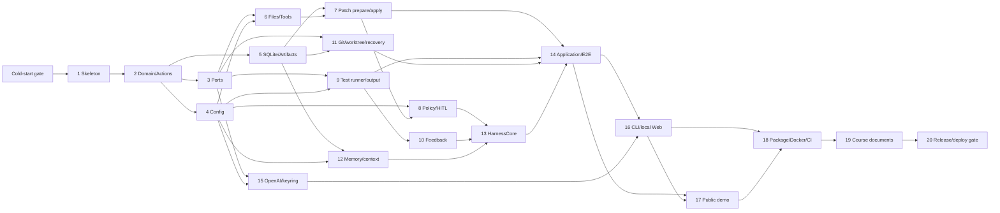

# Coding Agent Harness Implementation Plan

> **For agentic workers:** REQUIRED SUB-SKILL: Use `superpowers:subagent-driven-development` (recommended) or `superpowers:executing-plans` to implement this plan task-by-task. Every implementation Task must also invoke `superpowers:test-driven-development`. Steps use checkbox (`- [ ]`) syntax for tracking.

**Goal:** Build and distribute a self-implemented Python Coding Agent Harness that repairs trusted local Git-managed Python repositories through a deterministic pytest feedback loop, code-enforced governance, Mock-LLM tests, and safe local/public interfaces.

**Architecture:** A ports-and-adapters Python package separates immutable domain models and pure policy/feedback logic from SQLite, Git, subprocess, OpenAI, keyring, CLI, and Web adapters. `ApplicationService` performs task setup and recovery; `HarnessCore` alone owns the agent loop and state transitions. All LLM actions use strict schemas, all side effects cross typed ports and policy gates, and every successful patch automatically runs the frozen full acceptance command.

**Tech Stack:** Python 3.11/3.12, Pydantic v2, pytest, FastAPI, Jinja2, HTMX/minimal JavaScript, Typer, Uvicorn, stdlib `sqlite3`/`tomllib`/`subprocess`/`pathlib`, OpenAI low-level client, keyring, Git CLI, Docker/OCI, GitLab CI, GitHub Actions.

**SPEC baseline:** `1d8411d72c538034205b9fb9d8ec626645757e91`

## Global Constraints

- Do not use an existing Agent runner, Agent SDK loop, LangChain `AgentExecutor`, AutoGen, CrewAI, or LlamaIndex Agent.
- Core mechanisms must run offline with `ScriptedMockLLM`; tests must not require network access or real credentials.
- Python support is 3.11 and 3.12. Before the cold-start implementation attempt, create `.venv` with either version (`python -m venv .venv`), activate it (`.venv\Scripts\Activate.ps1` on PowerShell or `source .venv/bin/activate` on POSIX), then run `python -m pip install --upgrade pip pytest`. After Task 1 creates `pyproject.toml`, run `python -m pip install -e ".[dev]"` before its green tests.
- Python commands are the cross-platform normative entry points. Makefile targets are convenience wrappers for POSIX/CI and must never be required to complete a Task on Windows.
- TDD is mandatory for every Task: write the named failing test, run and observe the stated failure, add the minimum implementation, rerun, refactor, rerun the Task tests and `python -m pytest -q`.
- LLM-requested side effects require strict Action validation and Policy. Internal side effects require a legal Application/Core state transition and FrozenConfig.
- Tests and pytest configuration are immutable. Paths are worktree-relative, normalized, and symlink paths are rejected.
- Never use `shell=True`; subprocesses receive argument arrays, a cleaned allowlisted environment, bounded output, and process-tree termination.
- Never write a real API Key, unredacted raw test output, or sensitive exact artifacts to logs, SQLite, snapshots, UI, or LLM context.
- A Task is not complete until its focused tests and the full existing test suite pass and the two-stage review (spec compliance, then code quality) has no Critical issue.
- Each implementation Task is developed in an isolated development worktree and ends in its own commit/PR or MR. Update the Task checkbox and commit hash in this file after integration.
- Do not start implementation until the Cold-Start Validation Gate below is complete and its findings have been incorporated.

## Planned Repository Structure

```text
pyproject.toml                    package metadata, dependencies, CLI entry point, pytest config
Makefile                          one-command test/build/demo targets
src/coding_agent_harness/
  domain/                         immutable enums, IDs, Actions, results, feedback, approvals
  ports/                          Protocol interfaces for LLM/state/workspace/files/tests/credentials
  config/                         strict TOML models, monotonic merge, FrozenConfig/CapabilitySet
  security/                       redaction, path rules, Policy Engine, approval bindings
  patching/                       unified-diff prepare/apply/rollback
  feedback/                       pytest parsing, normalization, fingerprints, pure decisions
  core/                           context builder, memory service, HarnessCore state machine
  application/                    task setup, baseline, approvals, resume, reporting
  adapters/                       SQLite, artifacts, Git, filesystem, subprocess, OpenAI, keyring
  cli/                            Typer commands and local interactive confirmation
  web/                            FastAPI app, local security, templates/static assets
  demo/                           fixed Mock scenarios and resettable repositories
tests/
  unit/                           pure model/config/policy/feedback/core tests
  contract/                       adapter/port behavior suites
  integration/                    SQLite, patch, Git, subprocess, Web/CLI chains
  e2e/                            Mock main loop and real local pytest chain
  fixtures/                       pytest outputs and repository templates
scripts/                          deterministic mechanism-demo and final verification entry points
demo_repos/                       three immutable public-demo templates
Dockerfile                        fixed public demo image
.gitlab-ci.yml                    required GitLab jobs
.github/workflows/ci.yml          push CI required by course text
README.md                         installation, operation, security, distribution
SPEC_PROCESS.md                   brainstorming/plan/cold-start evidence
AGENT_LOG.md                      chronological implementation evidence
```

## Dependency DAG and Critical Path



**Critical path:** Gate → 1 → 2 → 3/4/5 → 6 → 7 → 8/9 → 10/11/12 → 13 → 14 → 16 → 17 → 18 → 19 → 20.

**Parallel candidates after their prerequisites:** Tasks 3, 4, and 5; Tasks 8, 9, and 11; Tasks 10 and 12; Task 15 alongside non-overlapping Core integration. Task 17 must follow Task 16 because both modify the Web layer. Parallel worktrees must not edit the same files; integration follows the DAG order.

## Cold-Start Validation Gate (before Task 1 implementation)

**Purpose:** Validate that `SPEC.md` and this plan are executable without hidden conversational context.

**Files:**
- Create during the validation session only: `SPEC_PROCESS.md`
- May modify after findings: `SPEC.md`, `PLAN.md`
- Do not merge cold-start implementation artifacts until the plan defects are resolved.

- [ ] Commit the reviewed `PLAN.md` on the planning branch; record its commit hash beside the SPEC baseline.
- [ ] Start a new session with a different agent product/type from the primary planning agent. Disable imported memory and provide only `SPEC.md` and `PLAN.md`.
- [ ] In an isolated disposable worktree, ask it to execute Task 1 and begin Task 2. Instruct: “Stop and ask on uncertainty; do not infer missing paths, signatures, or commands.”
- [ ] Record every question, mistaken interpretation, unexpected file choice, red/green command mismatch, and output difference in `SPEC_PROCESS.md`.
- [ ] Compare its Task 1/2 artifacts against the plan. Do not let the main implementation proceed during this audit.
- [ ] Patch SPEC/PLAN ambiguities, show before/after diffs in `SPEC_PROCESS.md`, discard or separately preserve the disposable implementation, and obtain human approval of the revised plan.

**Gate completion:** A different agent can execute Task 1 and understand Task 2 using only the two documents, or every discovered ambiguity has been explicitly repaired and reviewed.

---

### Task 1: Package Skeleton and One-Command Test Gate

**Goal / requirements:** Establish an installable `src` package, deterministic test entry point, dependency groups, and CI-neutral commands. Covers NFR-014, NFR-015; supports AC-011, AC-012.

**Dependencies:** Cold-Start Validation Gate complete.

**Files:**
- Create: `pyproject.toml`
- Create: `Makefile`
- Create: `src/coding_agent_harness/__init__.py`
- Create: `tests/unit/test_package_smoke.py`
- Create: `tests/unit/test_repository_hygiene.py`
- Create: `tests/conftest.py`
- Create: `.gitignore`
- Create: `AGENT_LOG.md`

**Interfaces:**
- Produces package `coding_agent_harness` with `__version__: str`.
- Produces normative commands `python -m pytest -q` and `python -m build`; `make test`/`make build` are optional convenience wrappers.

- [ ] **Environment:** Create/activate `.venv` using the Global Constraints commands and install only upgraded pip plus pytest. Do not install the package before observing the red tests.
- [ ] **Red 1:** Create `tests/unit/test_package_smoke.py` with `test_package_exposes_version_string`, `test_running_interpreter_is_supported`, and `test_requires_python_metadata_is_311_to_before_313`. The metadata test must parse `pyproject.toml` and assert `requires-python` is exactly compatible with `>=3.11,<3.13`, rather than inferring support from the current interpreter.
- [ ] Run `python -m pytest tests/unit/test_package_smoke.py -q`. **Expected:** collection fails with `ModuleNotFoundError: No module named 'coding_agent_harness'` because the package and metadata do not exist.
- [ ] **Red 2:** Create `tests/unit/test_repository_hygiene.py::test_gitignore_blocks_credentials_and_runtime_artifacts`, asserting `.env*`, private-key patterns, local DB/task artifacts, build output and Python caches are ignored.
- [ ] Run `python -m pytest tests/unit/test_repository_hygiene.py -q`. **Expected:** one assertion failure because `.gitignore` is absent; this command is separate so the package collection error cannot hide it.
- [ ] **Green:** Add `pyproject.toml` using setuptools `src` discovery, Python `>=3.11,<3.13`, runtime dependencies (`pydantic`, `typer`, `fastapi`, `uvicorn`, `jinja2`, `openai`, `keyring`, `platformdirs`) and dev dependencies (`pytest`, `pytest-cov`, `httpx`, `build`). Add the package and `__version__ = "0.1.0"`.
- [ ] Add `Makefile` convenience targets: `test` → `python -m pytest -q`; `build` → `python -m build`. Add `.gitignore` safety patterns and initialize `AGENT_LOG.md`; do not add Agent behavior.
- [ ] Run `python -m pip install -e ".[dev]"`, then `python -m pytest tests/unit/test_package_smoke.py tests/unit/test_repository_hygiene.py -q`. **Expected:** installation succeeds and all four tests pass.
- [ ] **Refactor/verify:** Run `python -m pytest -q` and `python -m build`. **Expected:** all tests pass; wheel and sdist are created under `dist/` without import errors.

**Completion:** Editable/package import works on Python 3.11/3.12, one-command tests work, and no Agent behavior exists yet.

**Suggested commit:** `chore: scaffold python package and test gate`

---

### Task 2: Immutable Domain Models and Strict Action Schema

**Goal / requirements:** Define the stable vocabulary used by every later Task and reject unknown/extra/invalid LLM actions, including `finish`. Covers FR-008, FR-011; SEC-001, SEC-002; supports AC-001, AC-002.

**Dependencies:** Task 1.

**Files:**
- Create: `src/coding_agent_harness/domain/enums.py`
- Create: `src/coding_agent_harness/domain/models.py`
- Create: `src/coding_agent_harness/domain/actions.py`
- Create: `src/coding_agent_harness/domain/errors.py`
- Create: `src/coding_agent_harness/domain/__init__.py`
- Create: `tests/unit/domain/test_actions.py`
- Create: `tests/unit/domain/test_models.py`

**Interfaces:**
- Produces `TaskStatus`, `ActionStatus`, `ApprovalStatus`, `FeedbackKind`, `PolicyOutcome`, `ToolErrorCode` enums.
- Produces frozen Pydantic models `TaskId`, `ValidatedAction`, `ToolResult`, `ProtocolError`, `TestRun`, `FeedbackDecision`, `FrozenCommand`.
- Produces discriminated actions: `ListFilesAction`, `ReadFileAction`, `SearchCodeAction`, `ApplyPatchAction`, `RunTestsAction`, `GitDiffAction`, `GitStatusAction`, `RunDiagnosticAction`, `RequestHumanAction`.
- Produces `parse_action(raw: str | dict[str, object]) -> ValidatedAction | ProtocolError`.

- [ ] **Red:** In `test_actions.py`, add `test_parse_known_action`, `test_rejects_extra_fields`, `test_rejects_finish_as_unknown_action`, `test_rejects_shell_string_for_diagnostic`, and `test_request_human_requires_reason`. In `test_models.py`, assert models are immutable and approval enum contains `pending/approved/consumed/executed/denied/cancelled/expired`.
- [ ] Run `python -m pytest tests/unit/domain -q`. **Expected:** collection fails because `coding_agent_harness.domain.actions` and enums do not exist.
- [ ] **Green:** Implement enums and strict Pydantic models with `extra="forbid"`, discriminated `type`, bounded reason/query/path strings, argument arrays, and no `FinishAction`.
- [ ] Implement `parse_action` so JSON/schema errors map to stable `ProtocolError(code, sanitized_message)` rather than escaping supplier text.
- [ ] Run `python -m pytest tests/unit/domain -q`. **Expected:** all named tests pass.
- [ ] **Refactor/verify:** Consolidate shared immutable config without weakening schemas; run `python -m pytest tests/unit/domain -q` then `python -m pytest -q`. **Expected:** all pass.

**Completion:** Later Tasks can import one canonical set of immutable types; unknown actions and extra fields are deterministic protocol errors.

**Suggested commit:** `feat: define domain models and strict action schema`

---

### Task 3: Ports and Adapter Contract Test Harness

**Goal / requirements:** Enforce dependency direction so Core never imports infrastructure. Covers SEC-014; supports AC-001, AC-002.

**Dependencies:** Task 2.

**Files:**
- Create: `src/coding_agent_harness/ports/llm.py`
- Create: `src/coding_agent_harness/ports/state.py`
- Create: `src/coding_agent_harness/ports/workspace.py`
- Create: `src/coding_agent_harness/ports/filesystem.py`
- Create: `src/coding_agent_harness/ports/testing.py`
- Create: `src/coding_agent_harness/ports/credentials.py`
- Create: `src/coding_agent_harness/ports/artifacts.py`
- Create: `src/coding_agent_harness/ports/__init__.py`
- Create: `tests/contract/fakes.py`
- Create: `tests/contract/test_port_contracts.py`

**Interfaces:**
- Produces typing `Protocol`s: `LLMClient.generate(context)`, `StateStore`, `WorkspacePort`, `FileSystemPort`, `TestRunner.run(request)`, `CredentialStore`, `ArtifactStore`.
- Produces reusable deterministic fakes and contract assertions for later adapters.

- [ ] **Red:** Add contract tests that instantiate named fake ports, record calls, return domain models, and fail static/runtime protocol checks when required methods are absent. Add `test_core_layer_does_not_import_adapters` scanning future `src/coding_agent_harness/core` imports.
- [ ] Run `python -m pytest tests/contract/test_port_contracts.py -q`. **Expected:** import failure for missing port modules.
- [ ] **Green:** Define narrow Protocol signatures and Fake implementations. State methods must include intent logging, legal transition compare-and-set, approval decision, atomic `consume_approval`, and snapshot load; no Policy method belongs on StateStore.
- [ ] Run the focused command. **Expected:** contract tests pass.
- [ ] **Refactor/verify:** Remove infrastructure-specific types from signatures; run `python -m pytest tests/contract -q` and full tests.

**Completion:** All planned adapters have explicit domain-only contracts and reusable fakes.

**Suggested commit:** `feat: define harness ports and contract fakes`

---

### Task 4: Strict TOML, FrozenConfig, and Capability Resolution

**Goal / requirements:** Implement built-in → user → commit-pinned repository configuration with monotonic restriction and mode capabilities. Covers FR-001–FR-004, FR-012; SEC-003, SEC-005, SEC-018, SEC-019, SEC-022; supports AC-005, AC-007, AC-017, AC-019.

**Dependencies:** Task 2.

**Files:**
- Create: `src/coding_agent_harness/config/models.py`
- Create: `src/coding_agent_harness/config/loader.py`
- Create: `src/coding_agent_harness/config/resolver.py`
- Create: `src/coding_agent_harness/config/defaults.py`
- Create: `src/coding_agent_harness/config/__init__.py`
- Create: `tests/unit/config/test_loader.py`
- Create: `tests/unit/config/test_resolver.py`
- Create: `tests/fixtures/config/valid_user.toml`
- Create: `tests/fixtures/config/broadening_repo.toml`
- Create: `tests/fixtures/config/conflicting_repo.toml`

**Interfaces:**
- Produces `UserConfig`, `RepoConfig`, `FrozenConfig`, `CapabilitySet`, `ConfigProvenance`, `ConfigConflict`.
- Produces `load_strict_toml(bytes)`, `resolve_config(builtin, user, repo, mode) -> FrozenConfig`, and `sha256_canonical_config`.

- [ ] **Red:** Add tests for unknown fields, environment interpolation text, whitelist intersection, protected/sensitive path union, numeric minimum, empty intersection conflict, repository attempts to exit demo mode, timeout >600, deterministic hash, and built-in `.env`/private-key/app-data exclusions surviving `paths.sensitive=[]`.
- [ ] Run `python -m pytest tests/unit/config -q`. **Expected:** import failures for missing config modules.
- [ ] **Green:** Implement strict Pydantic TOML models and pure merge functions. Keep absolute hard limits (600 seconds, 20 files, 2,000 lines, 1 MiB) in `defaults.py`, never as user-overridable fields.
- [ ] Implement real/demo CapabilitySets; demo excludes OpenAI, credentials, arbitrary paths and commands. Include per-field provenance and canonical SHA-256.
- [ ] Run focused tests. **Expected:** all pass, including property-style assertions that a lower layer never broadens capability.
- [ ] **Refactor/verify:** Isolate canonical serialization, run config tests and full suite.

**Completion:** Effective configuration is deterministic, frozen, traceable, and can only narrow safety boundaries.

**Suggested commit:** `feat: resolve frozen configuration and capabilities`

---

### Task 5: SQLite StateStore, Migrations, Artifact References, and Intent Log

**Goal / requirements:** Persist the complete state model, legal transitions, exact artifact references, approval consumption, locks, and crash evidence without storing unredacted output. Covers FR-013, FR-018–FR-020; NFR-009–NFR-013; SEC-004, SEC-009–SEC-011, SEC-015, SEC-021, SEC-022; supports AC-008, AC-018, AC-019.

**Dependencies:** Tasks 2 and 3.

**Files:**
- Create: `src/coding_agent_harness/adapters/sqlite/schema.sql`
- Create: `src/coding_agent_harness/adapters/sqlite/migrations.py`
- Create: `src/coding_agent_harness/adapters/sqlite/state_store.py`
- Create: `src/coding_agent_harness/adapters/sqlite/__init__.py`
- Create: `src/coding_agent_harness/adapters/artifacts/local_store.py`
- Create: `tests/integration/sqlite/test_migrations.py`
- Create: `tests/integration/sqlite/test_state_store.py`
- Create: `tests/integration/sqlite/test_approval_lifecycle.py`
- Create: `tests/integration/artifacts/test_local_store.py`

**Interfaces:**
- Implements `StateStore` and `ArtifactStore` from Task 3.
- Persists tables required by SPEC §11, including trust binding fields and canonical Action/diff/pre-image references.

- [ ] **Red:** Add migration tests asserting every required table, FK, unique task sequence and schema version. Add state tests for legal compare-and-set, illegal transition rejection, one active task/lease, intent `executing → interrupted/unknown_outcome`, and no automatic retry.
- [ ] Add approval tests for `pending → approved → consumed → executed`, explicit Resume before consume, a second consume failing, and crash after consume leaving approval consumed while Action becomes `unknown_outcome`.
- [ ] Add artifact tests for relative-only paths, symlink/escape rejection, SHA-256/size verification, `0700/0600` on POSIX or current-user ACL assertion on Windows, and no raw output in SQLite.
- [ ] Run `python -m pytest tests/integration/sqlite tests/integration/artifacts -q`. **Expected:** missing adapter/schema import failures.
- [ ] **Green:** Implement numbered migrations, FK enforcement, transactions/WAL, repository mappings, CAS transitions, leases, approval operations, and artifact manifests. StateStore persists decisions but never evaluates Policy validity.
- [ ] Run focused tests. **Expected:** all pass; deliberate second consumption and corrupt artifact reads fail deterministically.
- [ ] **Refactor/verify:** centralize transaction boundaries and row conversion; run focused tests and full suite.

**Completion:** A restart can reconstruct safe state and detect unknown outcomes without conflating SQLite transactions with filesystem atomicity.

**Suggested commit:** `feat: persist harness state and secure artifacts`

---

### Task 6: Guarded Filesystem, Typed Read/Search/Git/Diagnostic Tools

**Goal / requirements:** Implement typed non-Patch tools without arbitrary Shell or path escape. Covers FR-011, FR-014, FR-015; NFR-002, NFR-004; SEC-001–SEC-006, SEC-018; supports AC-007, AC-014.

**Dependencies:** Tasks 3 and 4.

**Files:**
- Create: `src/coding_agent_harness/security/paths.py`
- Create: `src/coding_agent_harness/adapters/filesystem/local_filesystem.py`
- Create: `src/coding_agent_harness/adapters/git/readonly.py`
- Create: `src/coding_agent_harness/adapters/process/diagnostic.py`
- Create: `src/coding_agent_harness/core/tool_dispatcher.py`
- Test: `tests/unit/security/test_paths.py`
- Test: `tests/integration/tools/test_filesystem_tools.py`
- Test: `tests/integration/tools/test_diagnostic_tools.py`
- Test: `tests/unit/core/test_tool_dispatcher.py`

**Interfaces:** Implements `FileSystemPort`; produces `PathFacts`, `normalize_relative_path`, and `TypedToolDispatcher.dispatch(action, capabilities) -> ToolResult` for already-authorized actions.

- [ ] **Red:** Test absolute paths, drive letters, `..`, NUL, symlink components, app-data paths, `.env` variants, private keys and unsupported binary reads; assert zero file access only for these forbidden reads.
- [ ] Test that protected test assets such as `tests/test_example.py`, `test_example.py`, `example_test.py` and `conftest.py` remain readable/searchable through `read_file`/`search_code`; immutability is enforced only for create/modify/move/delete operations in Patch/Policy.
- [ ] Test 512 KiB read bound, 200-result search bound, Git status/diff argv, diagnostic whitelist intersection, and rejection of `|`, `>`, `&&`, `$()` and unknown executables.
- [ ] Test dispatcher rejects an action missing from CapabilitySet without invoking the fake handler.
- [ ] Run `python -m pytest tests/unit/security/test_paths.py tests/integration/tools tests/unit/core/test_tool_dispatcher.py -q`. **Expected:** missing modules/classes.
- [ ] **Green:** Implement rooted path/symlink checks, bounded UTF-8 reads/search, dedicated Git adapters, allowlist-based `shell=False` diagnostics and an Action-class registry without Policy logic.
- [ ] Run the focused command. **Expected:** all pass; spies prove rejected requests have no side effects.
- [ ] **Refactor/verify:** share bounded-output/path-fact types; rerun focused tests and `python -m pytest -q`.

**Completion:** Non-Patch tools are typed, bounded and capability-gated; allowed test assets are readable/searchable, forbidden sensitive/out-of-bound/binary reads have zero access, and arbitrary Shell remains unavailable.

**Suggested commit:** `feat: add guarded filesystem and typed tools`

---

### Task 7: Strict Unified Diff Prepare/Apply and Compensation Rollback

**Goal / requirements:** Build two-phase Patch preparation/application, exact facts, pre-images, per-file atomic replacement and compensation. Covers FR-008, FR-009, FR-012, FR-014–FR-017; NFR-013; SEC-002–SEC-008; supports AC-006–AC-009.

**Dependencies:** Tasks 5 and 6.

**Files:**
- Create: `src/coding_agent_harness/patching/models.py`
- Create: `src/coding_agent_harness/patching/parser.py`
- Create: `src/coding_agent_harness/patching/applier.py`
- Create: `src/coding_agent_harness/patching/rollback.py`
- Test: `tests/unit/patching/test_prepare.py`
- Test: `tests/integration/patching/test_apply.py`
- Test: `tests/integration/patching/test_compensation.py`
- Create: `tests/fixtures/patches/modify_create_delete.diff`
- Create: `tests/fixtures/patches/protected_test.diff`
- Create: `tests/fixtures/patches/invalid_fuzz.diff`

**Interfaces:** Produces immutable `PreparedPatch`, `PatchFacts`, `PatchFilePlan`, `AppliedPatch`, `ApplyFailure`, `RollbackResult`; `prepare(diff, snapshot)` is pure and `apply(prepared, authorization)` owns writes/compensation.

- [ ] **Red:** Test exact UTF-8 modify/create/delete, multi-file facts, operation types, file/line counts, sensitive/test-asset flags and normalized hash. A syntactically valid Patch targeting `tests/test_example.py` must prepare successfully with `PatchFacts.touches_test_assets=True` and no write.
- [ ] Test protocol-level rejection for binary diff, symlink, absolute/drive/`..`, hunk mismatch, offset/fuzz, mode change and complex rename. Assert no filesystem write after every `prepare` result.
- [ ] Test all files prevalidate, hashes recheck, same-directory temp + replace, authorized deletion, and success pre/post hashes.
- [ ] Inject failure on file 2 of 3; assert file 1 restores its pre-hash, file 3 stays unchanged, pytest is not called, and mismatch returns conflict without overwrite.
- [ ] Run `python -m pytest tests/unit/patching tests/integration/patching -q`. **Expected:** missing patching modules.
- [ ] **Green:** Implement strict parsing, normalization, hunk/hash checks and fact calculation without governance decisions. Implement in-memory images, artifact pre-images, intent callback, sequential replace and compensation; only Policy may deny a valid test-asset Patch.
- [ ] Run focused tests. **Expected:** all pass, including injected mid-write failure.
- [ ] **Refactor/verify:** separate pure preparation from orchestration; run focused/full suites.

**Completion:** Prepare is side-effect free; apply is revalidated/audited; deterministic failures restore known pre-images and never run pytest.

**Suggested commit:** `feat: implement strict patch transactions`

---

### Task 8: Policy Engine, Test Protection, and Exact HITL Binding

**Goal / requirements:** Decide allow/deny/approval from facts and frozen rules, validate trust/approval bindings, and keep governance out of prompts and StateStore. Covers FR-011–FR-015; SEC-003–SEC-006, SEC-015, SEC-021, SEC-022; supports AC-007, AC-008, AC-018, AC-019.

**Dependencies:** Tasks 4, 5, and 7.

**Files:**
- Create: `src/coding_agent_harness/security/policy.py`
- Create: `src/coding_agent_harness/security/approvals.py`
- Create: `src/coding_agent_harness/security/trust.py`
- Test: `tests/unit/security/test_policy.py`
- Test: `tests/unit/security/test_approval_binding.py`
- Test: `tests/unit/security/test_trust_binding.py`

**Interfaces:** Produces pure `PolicyEngine.evaluate(action, facts, config, approval) -> PolicyDecision`, `ApprovalBinding`, `TrustBinding` and canonical validation results.

- [ ] **Red:** Feed Policy a successfully prepared `PatchFacts(touches_test_assets=True)` and assert hard deny with a stable test-protection reason, no approval option and no apply call. Also hard-deny protected config, path/symlink/binary/Shell/capability violations and demo escape; approval cannot override deny.
- [ ] Test approval for >5 files, >300 lines, source delete, sensitive path and dependency/build config; hard deny >20 files, >2,000 lines or >1 MiB.
- [ ] Test exact binding to task, canonical Action/diff, target hashes, FrozenConfig, CapabilitySet and risk. Any mutation invalidates; approved is non-executable until Resume; consumed cannot repeat.
- [ ] Test trust binding includes repo/base/command/config/capability hashes, threat notice/provider/data categories and fails on change.
- [ ] Run `python -m pytest tests/unit/security/test_policy.py tests/unit/security/test_approval_binding.py tests/unit/security/test_trust_binding.py -q`. **Expected:** missing Policy/binding symbols.
- [ ] **Green:** Implement pure ordered rules (`deny` > approval > allow), canonical bindings and validation; never read SQLite in Policy.
- [ ] Run focused tests. **Expected:** all matrix cases pass.
- [ ] **Refactor/verify:** table-drive stable reason codes; run focused/full tests.

**Completion:** Governance is deterministic code; approvals are one-action/one-state; trust changes force reconfirmation.

**Suggested commit:** `feat: enforce policy and exact approval bindings`

---

### Task 9: Bounded Pytest Runner, Output Processing, and Redaction

**Goal / requirements:** Execute only frozen/full or controlled local pytest using cleaned environment, bounded capture and process-tree termination. Covers FR-005–FR-010; NFR-001–NFR-004, NFR-010; SEC-008–SEC-013, SEC-018; supports AC-006, AC-015, AC-017.

**Dependencies:** Tasks 3 and 4.

**Files:**
- Create: `src/coding_agent_harness/security/redaction.py`
- Create: `src/coding_agent_harness/adapters/process/runner.py`
- Create: `src/coding_agent_harness/adapters/process/pytest_runner.py`
- Create: `src/coding_agent_harness/feedback/output.py`
- Test: `tests/unit/security/test_redaction.py`
- Test: `tests/integration/process/test_pytest_runner.py`
- Test: `tests/integration/process/test_process_tree.py`
- Create: `tests/fixtures/subprocess_projects/failing/test_failure.py`
- Create: `tests/fixtures/subprocess_projects/timeout_tree/spawn_child.py`
- Create: `tests/fixtures/subprocess_projects/timeout_tree/test_timeout.py`

**Interfaces:** Implements `TestRunner.run(TestRequest) -> TestExecution`; `TestExecution` owns a transient in-memory `BoundedRawOutput`. Produces persistable `SanitizedTestOutput` and recursive `redact_fields`; the pytest parser in Task 10 consumes bounded raw output before field-level redaction of its structured result.

- [ ] **Red:** Accept only `pytest` and `python -m pytest`; reject changed frozen argv, shell syntax and wrong executable. Assert fixed worktree cwd and `shell=False` via spy launcher.
- [ ] Test environment allowlist removes OpenAI/cloud/Git credentials, timeout kills a spawned child tree, capture stops at 1 MiB, keeps head/tail and sets `truncated`.
- [ ] Test redaction of exact Key values, environment assignments, absolute paths, exception text and nested fields. Assert bounded raw output may be passed only to the parser callback and never to fake StateStore/logger/LLM.
- [ ] Run `python -m pytest tests/unit/security/test_redaction.py tests/integration/process -q`. **Expected:** missing runner/redaction modules.
- [ ] **Green:** Implement launcher/termination, bounded concurrent stdout/stderr, frozen command validation and allowlisted environment. Keep bounded raw bytes in memory; expose explicit parser input and separate sanitized-output persistence path.
- [ ] Run focused tests. **Expected:** all pass; child PID is gone after timeout.
- [ ] **Refactor/verify:** isolate platform process-tree strategy; run focused/full tests.

**Completion:** Pytest execution is bounded/auditable, raw output is memory-only, and no Harness/cloud/Git credential reaches target code.

**Suggested commit:** `feat: run pytest with bounded sanitized output`

---

### Task 10: Pytest Parser, Fingerprints, and Pure Feedback Engine

**Goal / requirements:** Implement the main contribution: stable failure extraction, summaries, fingerprints and objective progress/regression/loop decisions. Covers FR-006–FR-010; NFR-004, NFR-010; SEC-007–SEC-010; supports AC-003, AC-006, AC-009.

**Dependencies:** Task 9.

**Files:**
- Create: `src/coding_agent_harness/feedback/pytest_parser.py`
- Create: `src/coding_agent_harness/feedback/normalize.py`
- Create: `src/coding_agent_harness/feedback/fingerprint.py`
- Create: `src/coding_agent_harness/feedback/engine.py`
- Test: `tests/unit/feedback/test_pytest_parser.py`
- Test: `tests/unit/feedback/test_normalize.py`
- Test: `tests/unit/feedback/test_engine.py`
- Create: `tests/fixtures/pytest_outputs/pass.txt`
- Create: `tests/fixtures/pytest_outputs/failure.txt`
- Create: `tests/fixtures/pytest_outputs/collection_error.txt`
- Create: `tests/fixtures/pytest_outputs/syntax_error.txt`
- Create: `tests/fixtures/pytest_outputs/environment_error.txt`
- Create: `tests/fixtures/pytest_outputs/truncated.txt`

**Interfaces:** Produces pure `parse_pytest(raw: BoundedRawOutput, execution) -> ParsedTestResult`, `redact_parsed_result(result) -> SanitizedParsedTestResult`, and `FeedbackEngine.analyze(previous, current, source_diff, history) -> FeedbackDecision`, with no infrastructure-port dependencies.

- [ ] **Red:** Add pass, normal failure, collection/project syntax error, missing interpreter/plugin, timeout, ANSI/path/time/temp-dir, truncation and unparseable raw-output fixtures. Assert parser extracts node IDs/exception/frames from bounded raw content before redaction.
- [ ] Test field-level redaction after parsing: absolute paths, environment text, exception strings and possible secrets are removed from `SanitizedParsedTestResult`; raw and unredacted parsed objects never reach persistence/logger/LLM fakes.
- [ ] Test: failure-set decrease/no additions = progress; syntax/collection recovery = progress; same fail+same source = no-op; changed source+same failure = no test progress; new failure/syntax = regression; ambiguous = changed without reset; `A→B→A` = loop.
- [ ] Assert fingerprints include phase, node IDs, exception, normalized summary and in-project frames, stable across irrelevant variation.
- [ ] Run `python -m pytest tests/unit/feedback -q`. **Expected:** missing parser/engine modules.
- [ ] **Green:** Implement raw bounded-output parsing, then structured field-level redaction, deterministic normalization, bounded summary, canonical hash and pure decision table; never guess pass.
- [ ] Run focused tests. **Expected:** all matrix rows pass.
- [ ] **Refactor/verify:** split normalization/classification; run focused/full tests twice and compare hashes.

**Completion:** Feedback works deterministically without an LLM and covers every SPEC classification.

**Suggested commit:** `feat: classify pytest feedback and progress`

---

### Task 11: Git Worktree Manager, Trust Preflight, Locks, and Recovery

**Goal / requirements:** Isolate target repos, freeze base/config input order, enforce clean Git state and validate Resume. Covers FR-001–FR-004, FR-016–FR-020; NFR-012, NFR-013; SEC-006, SEC-013, SEC-022; supports AC-014, AC-018, AC-019.

**Dependencies:** Tasks 3 and 5.

**Files:**
- Create: `src/coding_agent_harness/adapters/git/workspace.py`
- Create: `src/coding_agent_harness/application/preflight.py`
- Create: `src/coding_agent_harness/application/recovery.py`
- Create: `src/coding_agent_harness/adapters/locking/file_lease.py`
- Test: `tests/integration/git/test_preflight.py`
- Test: `tests/integration/git/test_worktree.py`
- Test: `tests/integration/git/test_recovery.py`
- Test: `tests/integration/locking/test_file_lease.py`

**Interfaces:** Implements `WorkspacePort`; produces `RepoFacts`, `WorkspaceHandle`, `SafetyCheckpoint`, `ResumeValidationResult`; reads repo TOML from frozen commit before worktree creation.

- [ ] **Red:** Reject non-Git/dirty repo; test immutable ref resolution, config read via `git show <base>:.coding-harness.toml`, branch `harness/fix-<task-id>`, and worktree blob-hash verification.
- [ ] Test no automatic merge/push/publish/cleanup, one task/executor lease and stale lease handling.
- [ ] Test Resume revalidates worktree, base, trust/config/capability/file hashes and checkpoint; changed trust stays paused; unknown intent never retries.
- [ ] Run `python -m pytest tests/integration/git tests/integration/locking -q`. **Expected:** missing workspace/recovery modules.
- [ ] **Green:** Implement `shell=False` Git argv adapter, managed worktree registry, lease and Resume validation.
- [ ] Run focused tests. **Expected:** all pass with temporary real Git repositories.
- [ ] **Refactor/verify:** centralize Git error mapping; run focused/full tests.

**Completion:** All target actions stay in a verified worktree and stale trust/state cannot resume silently.

**Suggested commit:** `feat: manage isolated git worktrees and recovery`

---

### Task 12: Structured Memory and Sanitized Context Builder

**Goal / requirements:** Persist validated project/task memories and build deterministic bounded outbound-safe LLM context. Covers FR-021; NFR-002, NFR-010; SEC-009–SEC-011, SEC-017–SEC-020; supports AC-001, AC-017.

**Dependencies:** Tasks 4 and 5.

**Files:**
- Create: `src/coding_agent_harness/core/memory.py`
- Create: `src/coding_agent_harness/core/context.py`
- Test: `tests/unit/core/test_memory.py`
- Test: `tests/unit/core/test_context.py`
- Test: `tests/integration/sqlite/test_memory_repository.py`

**Interfaces:** Produces `MemoryRecord`, `MemorySlice`, `PromptContext`, `ContextManifest` and `ContextBuilder.build(snapshot) -> PromptContext`.

- [ ] **Red:** Test allowed memory types, Schema/length/source, non-executable semantics, credential rejection, and task ID or stable project identity constraint.
- [ ] Test deterministic ranking by project/path/tags/type/time, capped at 10 records/8 KiB.
- [ ] Test context records provider/data categories, excludes sensitive paths, recursively redacts tool/test/errors, caps feedback at 32 KiB, and excludes exact artifacts/pre-images/canonical Action.
- [ ] Run `python -m pytest tests/unit/core/test_memory.py tests/unit/core/test_context.py tests/integration/sqlite/test_memory_repository.py -q`. **Expected:** missing memory/context symbols.
- [ ] **Green:** Implement validated queries and pure bounded context assembly using redaction and path/capability rules.
- [ ] Run focused tests. **Expected:** all pass; identical input yields byte-identical context/hash.
- [ ] **Refactor/verify:** separate selection manifest from provider rendering; run focused/full tests.

**Completion:** Memory is explainable/deterministic and cannot bypass outbound-data safety.

**Suggested commit:** `feat: add structured memory and safe context`

---

### Task 13: ScriptedMockLLM and HarnessCore State Machine

**Goal / requirements:** Implement the self-owned agent loop, strict Action handling, budgets, Policy/tool routing, deterministic state transitions and terminal behavior. Covers FR-008–FR-013, FR-018–FR-020; SEC-001–SEC-004, SEC-007, SEC-014, SEC-021; supports AC-001–AC-003, AC-008, AC-014, AC-018.

**Dependencies:** Tasks 2, 3, 5, 8, 10, and 12.

**Files:**
- Create: `src/coding_agent_harness/adapters/llm/scripted_mock.py`
- Create: `src/coding_agent_harness/core/budget.py`
- Create: `src/coding_agent_harness/core/state_machine.py`
- Create: `src/coding_agent_harness/core/harness.py`
- Test: `tests/unit/adapters/test_scripted_mock.py`
- Test: `tests/unit/core/test_budget.py`
- Test: `tests/unit/core/test_state_machine.py`
- Test: `tests/unit/core/test_harness.py`

**Interfaces:** Produces `ScriptedMockLLM(actions)` with recorded inputs; `HarnessCore.step(task_id) -> CoreOutcome`; pure transition table; action and feedback budget counters.

- [ ] **Red:** Test Mock returns actions in order, records exact contexts, and errors deterministically when exhausted.
- [ ] Test invalid Schema, unknown `finish`, illegal params and Policy deny consume Action budget and feed a structured error; 40 Actions or 8 feedback rounds stops before another LLM call.
- [ ] Test valid `request_human` enters PausedForHuman only after Action validation; confirmed loop enters Stopped; two no-progress or two changed states pause; changed does not reset no-progress.
- [ ] Test require-approval enters AwaitingApproval; approved remains waiting; consumed unknown outcome cannot retry; read-only tool result returns to Deciding.
- [ ] Run `python -m pytest tests/unit/adapters/test_scripted_mock.py tests/unit/core/test_budget.py tests/unit/core/test_state_machine.py tests/unit/core/test_harness.py -q`. **Expected:** missing Mock/Core modules.
- [ ] **Green:** Implement one-step loop orchestration solely over ports, explicit transition table and pre-call budget gate. Do not add automatic pytest/rollback orchestration yet.
- [ ] Run focused tests. **Expected:** all named transitions and negative call-count assertions pass.
- [ ] **Refactor/verify:** keep transition computation pure and side effects in HarnessCore; run focused/full tests.

**Completion:** Removing the real LLM leaves a deterministic, testable self-implemented main loop with no infrastructure imports.

**Suggested commit:** `feat: implement harness core state machine`

---

### Task 14: ApplicationService, Automatic Full Tests, Rollback, and E2E Main Chain

**Goal / requirements:** Connect preflight, trust, worktree, baseline, Core, Patch, automatic acceptance, regression rollback, approval Resume and reporting. Covers FR-001–FR-020, FR-023; NFR-006, NFR-009, NFR-012, NFR-013; SEC-002, SEC-007–SEC-010, SEC-015, SEC-021, SEC-022; supports AC-002–AC-009, AC-014, AC-015, AC-018, AC-019.

**Dependencies:** Tasks 7, 9, 10, 11, and 13.

**Files:**
- Create: `src/coding_agent_harness/application/service.py`
- Create: `src/coding_agent_harness/application/baseline.py`
- Create: `src/coding_agent_harness/application/approvals.py`
- Create: `src/coding_agent_harness/application/reporting.py`
- Test: `tests/e2e/test_mock_repair_loop.py`
- Test: `tests/e2e/test_regression_rollback.py`
- Test: `tests/e2e/test_approval_resume.py`
- Test: `tests/e2e/test_real_pytest_chain.py`
- Create: `tests/fixtures/repos/failing_counter/pyproject.toml`
- Create: `tests/fixtures/repos/failing_counter/counter.py`
- Create: `tests/fixtures/repos/failing_counter/tests/test_counter.py`

**Interfaces:** Produces `ApplicationService.create_task`, `confirm_trust`, `run_baseline`, `run_until_pause`, `record_approval`, `resume`, `cancel`, `report`; Core remains the only agent loop.

- [ ] **Red:** With fakes, test order: resolve base → read config from commit → freeze config/capability → show trust → confirm → create/verify worktree → baseline. Baseline pass must never call LLM or modify files; environment/unparseable pauses.
- [ ] Test successful Patch automatically enters testing without an LLM `run_tests`, blocks a second Patch until feedback, and only current source/command/config hash pass can enter Succeeded.
- [ ] Test regression restores only current Patch, runs `recovery_test_run` without incrementing feedback rounds, confirms previous fingerprint and feeds rollback result; conflict pauses.
- [ ] Test approval decision is recorded; approved waits for explicit Resume; binding is revalidated, atomically consumed, then executed; crash leaves consumed + Action unknown outcome.
- [ ] Run `python -m pytest tests/e2e/test_mock_repair_loop.py tests/e2e/test_regression_rollback.py tests/e2e/test_approval_resume.py -q`. **Expected:** missing ApplicationService and failures proving orchestration absent.
- [ ] **Green:** Implement ApplicationService and report assembly using existing ports. Persist each SQLite record set transactionally while keeping filesystem/process operations outside DB transactions.
- [ ] Add real local chain fixture whose baseline `python -m pytest -q` fails, Scripted Mock applies a source-only fix, and automatic full pytest passes. Run `python -m pytest tests/e2e/test_real_pytest_chain.py -q`. **Expected before fixture integration:** fail because real runner is not wired; **after:** one test passes with frozen argv/cwd/clean environment assertions.
- [ ] **Refactor/verify:** separate task setup, approval and report coordinators; run `python -m pytest tests/e2e -q` and full suite.

**Completion:** The minimum course main chain runs offline end-to-end and a real bounded pytest subprocess proves the adapters are actually connected.

**Suggested commit:** `feat: orchestrate repair lifecycle end to end`

---

### Task 15: OpenAI Single-Generation Adapter and Keyring CredentialStore

**Goal / requirements:** Add one real provider without importing an Agent runner, and manage credentials through OS keyring/environment with complete outbound-data controls. Covers FR-022; SEC-009–SEC-012, SEC-017–SEC-020; supports AC-010, AC-017.

**Dependencies:** Tasks 3, 4, 9, and 12.

**Files:**
- Create: `src/coding_agent_harness/adapters/llm/openai_client.py`
- Create: `src/coding_agent_harness/adapters/credentials/keyring_store.py`
- Create: `src/coding_agent_harness/adapters/credentials/fake_store.py`
- Create: `src/coding_agent_harness/security/provider_errors.py`
- Test: `tests/unit/adapters/test_openai_client.py`
- Test: `tests/contract/test_credential_store.py`
- Test: `tests/unit/security/test_outbound_context.py`

**Interfaces:** Implements `LLMClient` and `CredentialStore`; OpenAI adapter exposes exactly one `generate(PromptContext)` operation and maps supplier failures to redacted internal errors.

- [ ] **Red:** Mock the low-level OpenAI client and assert one generation call with FrozenConfig model; no Agents SDK/runner import; strict raw response returned to Task 2 parser.
- [ ] Test environment → keyring → missing precedence; hidden set/status/update/clear contract; status never returns Key; Fake store never touches OS keyring.
- [ ] Test trust manifest includes provider/data categories; sensitive-path content, exact artifacts, over-budget fields and known credential values never reach mocked OpenAI. Mock mode must not instantiate OpenAI or CredentialStore.
- [ ] Test authentication/rate-limit/timeout/provider exceptions become stable redacted internal errors and never include request headers/Key.
- [ ] Run `python -m pytest tests/unit/adapters/test_openai_client.py tests/contract/test_credential_store.py tests/unit/security/test_outbound_context.py -q`. **Expected:** missing adapters.
- [ ] **Green:** Implement injected low-level client, provider error mapper, keyring store and Fake store. Do not retry secretly; return PausedForHuman-class errors.
- [ ] Run focused tests. **Expected:** all pass with no network or real keyring access.
- [ ] **Refactor/verify:** inspect dependency tree/imports for prohibited Agent packages; run focused/full tests.

**Completion:** Real mode can make one safe OpenAI generation call; tests remain offline and credentials never cross unsafe boundaries.

**Suggested commit:** `feat: add openai and keyring adapters`

---

### Task 16: Typer CLI and Secured Local WebUI

**Goal / requirements:** Expose the shared ApplicationService locally with trust/approval UX, key commands and browser protections. Covers FR-001–FR-004, FR-013, FR-022, FR-023; NFR-005–NFR-008; SEC-013, SEC-016, SEC-017, SEC-022; supports AC-004, AC-008, AC-010, AC-011, AC-019.

**Dependencies:** Tasks 14 and 15.

**Files:**
- Create: `src/coding_agent_harness/cli/app.py`
- Create: `src/coding_agent_harness/web/app.py`
- Create: `src/coding_agent_harness/web/security.py`
- Create: `src/coding_agent_harness/web/templates/base.html`
- Create: `src/coding_agent_harness/web/templates/task.html`
- Create: `src/coding_agent_harness/web/static/app.js`
- Test: `tests/integration/cli/test_cli.py`
- Test: `tests/integration/web/test_local_security.py`
- Test: `tests/integration/web/test_task_views.py`
- Modify: `pyproject.toml`

**Interfaces:** Adds `coding-agent-harness` entry point with `run`, `web`, `key set/status/clear`; provides `create_local_app(application, security_config)` sharing the same service/Core.

- [ ] **Red:** CLI tests assert interactive trust is not preselected, noninteractive execution needs `--trust-repo`, provider/data categories are shown, approval uses local prompt (no CSRF fields), and key status never prints Key.
- [ ] Web tests assert bind host rejects non-`127.0.0.1`, bootstrap token is high-entropy/short-lived/one-use, URL fragment exchange yields short-lived HttpOnly SameSite=Strict cookie, and token never appears in logs/SQLite.
- [ ] Test all writes/approvals require Session, CSRF, exact Host/Origin, method and content type; wildcard CORS is absent and Referrer-Policy is `no-referrer`.
- [ ] Test pages show config provenance, risk, diff redacted view, Action hash, approval state, budgets, timeline and report; approved Action does not execute until separate Resume.
- [ ] Run `python -m pytest tests/integration/cli tests/integration/web -q`. **Expected:** missing CLI/Web modules and entry point.
- [ ] **Green:** Implement thin CLI/routes over injected ApplicationService; add minimal accessible server-rendered Open Design-aligned templates and bundled script without CDN.
- [ ] Run focused tests. **Expected:** all pass; browser-security negative requests return 4xx and do not call service.
- [ ] **Refactor/verify:** consolidate presentation DTOs; run focused/full tests and `coding-agent-harness --help`.

**Completion:** Local CLI/Web can operate tasks and approvals without duplicating Core or exposing local service cross-origin.

**Suggested commit:** `feat: add cli and secured local web ui`

---

### Task 17: Fixed Public Mock WebUI and Three Mechanism Demos

**Goal / requirements:** Deliver deterministic resettable public scenarios with backend capability isolation and downloadable sanitized reports. Covers FR-024; NFR-007; SEC-003–SEC-008, SEC-012, SEC-019, SEC-021; supports AC-005, AC-013, AC-016.

**Dependencies:** Tasks 14 and 16. Do not run this Task in parallel with Task 16 because both modify the Web layer.

**Files:**
- Create: `src/coding_agent_harness/demo/scenarios.py`
- Create: `src/coding_agent_harness/demo/workspaces.py`
- Create: `src/coding_agent_harness/web/demo_app.py`
- Create: `src/coding_agent_harness/web/templates/demo.html`
- Create: `demo_repos/feedback_success/pyproject.toml`
- Create: `demo_repos/feedback_success/calculator.py`
- Create: `demo_repos/feedback_success/tests/test_calculator.py`
- Create: `demo_repos/governance_hitl/pyproject.toml`
- Create: `demo_repos/governance_hitl/service.py`
- Create: `demo_repos/governance_hitl/tests/test_service.py`
- Create: `demo_repos/loop_stop/pyproject.toml`
- Create: `demo_repos/loop_stop/toggle.py`
- Create: `demo_repos/loop_stop/tests/test_toggle.py`
- Create: `scripts/run_mechanism_demo.py`
- Test: `tests/e2e/test_demo_scenarios.py`
- Test: `tests/integration/web/test_demo_capabilities.py`

**Interfaces:** Produces fixed scenario IDs `feedback_success`, `governance_hitl`, `loop_stop`; `create_demo_app()` injects ScriptedMockLLM, immutable demo CapabilitySet and smaller frozen budgets.

- [ ] **Red:** Scenario 1 must baseline fail, expose feedback in Mock input, produce a different next Patch, auto-test and succeed. Scenario 2 must hard-deny test modification, require approval for a legal high-impact Patch, wait for Resume and execute once. Scenario 3 must create state A→B→A and stop with no further Mock call.
- [ ] Test each run copies a read-only template to a separate temporary workspace and reset reproduces identical key Action/feedback/terminal hashes.
- [ ] Test backend rejects arbitrary prompt/path/Patch/command/upload/mode switches; OpenAI and CredentialStore fakes fail the test if called; exported report contains no exact artifacts/raw output.
- [ ] Run `python -m pytest tests/e2e/test_demo_scenarios.py tests/integration/web/test_demo_capabilities.py -q`. **Expected:** missing demo modules/scenarios.
- [ ] **Green:** Implement fixed scripts, templates, backend-only capability injection, reset lifecycle and report export. Use stricter demo budgets than local defaults.
- [ ] Run focused tests and `python scripts/run_mechanism_demo.py --all`. **Expected:** tests pass; script exits 0 and prints the three expected terminal outcomes.
- [ ] **Refactor/verify:** remove any user-controlled execution fields; run focused/full tests twice and compare sanitized report hashes excluding timestamps.

**Completion:** The course-required mechanisms are independently repeatable through tests, script and public-safe WebUI without real LLM access.

**Suggested commit:** `feat: add deterministic public mechanism demos`

---

### Task 18: Package, Docker Build Contract, and Dual CI

**Goal / requirements:** Produce installable artifacts, a non-root fixed-demo image and identical GitLab/GitHub automated gates. Covers NFR-014, NFR-015; supports AC-011, AC-012.

**Dependencies:** Tasks 1–17.

**Files:**
- Modify: `pyproject.toml`
- Modify: `Makefile`
- Create: `Dockerfile`
- Create: `.dockerignore`
- Create: `.gitlab-ci.yml`
- Create: `.github/workflows/ci.yml`
- Test: `tests/integration/distribution/test_package.py`
- Test: `tests/integration/distribution/test_container_contract.py`
- Test: `tests/integration/distribution/test_ci_contract.py`

**Interfaces:** Provides wheel/sdist, pipx-compatible CLI, non-root fixed-demo OCI image, normative Python build/test commands and equivalent convenience/CI commands.

- [ ] **Red:** Test built-wheel installation in a temporary venv and `coding-agent-harness --help`; test Dockerfile non-root user, fixed demo command, no key env/host mount/real-mode switch; test GitLab job names and GitHub push workflow invoke the same Python commands.
- [ ] Run `python -m pytest tests/integration/distribution/test_package.py tests/integration/distribution/test_container_contract.py tests/integration/distribution/test_ci_contract.py -q`. **Expected:** failures because packaging metadata, Dockerfile and CI files are absent/incomplete.
- [ ] **Green:** Finalize package metadata/entry point, add Docker/.dockerignore, GitLab `unit-test`/`package-build`/`docker-build`, and matching GitHub workflow. Make targets only wrap normative Python commands.
- [ ] Run the focused command. **Expected:** all contract tests pass.
- [ ] **Refactor/verify:** Run `python -m pytest -q`, `python -m build`, and `docker build -t coding-agent-harness-demo:local .`. **Expected:** tests pass, wheel/sdist exist, image builds locally without credentials.

**Completion:** Local package/image builds and both CI definitions are deterministic; no registry push or external deployment occurs.

**Suggested commit:** `build: package harness and add dual ci`

---

### Task 19: README, Process Evidence, License, and Course Delivery Audit

**Goal / requirements:** Complete human-facing safety/distribution documentation and course process evidence without generating the student's reflection. Supports AC-011–AC-016 and all course delivery requirements.

**Dependencies:** Task 18 and the Cold-Start Validation Gate record.

**Files:**
- Create: `README.md`
- Modify: `SPEC_PROCESS.md`
- Modify: `AGENT_LOG.md`
- Create: `LICENSE`
- Create: `scripts/check_course_delivery.py`
- Test: `tests/integration/delivery/test_required_documents.py`
- Test: `tests/integration/delivery/test_course_checklist.py`

**Interfaces:** Provides the complete README contract, process evidence, license inventory hook and `python scripts/check_course_delivery.py [--preflight]`. Preflight distinguishes an absent student-owned `REFLECTION.md` from failures in AI-produced project artifacts.

- [ ] **Red:** Test README required sections (overview/install/run/distribution/directory/Key/safety/known limits/CI/deployment/cleanup), SPEC_PROCESS three iterations plus cold-start before/after diffs, AGENT_LOG Task/skill/context/commit/human/lesson fields, LICENSE presence, and delivery checker refusing missing CI/demo/mock tests. Test `--preflight` reports a missing `REFLECTION.md` as `student-owned pending` without creating it or failing otherwise complete AI-owned artifacts.
- [ ] Run `python -m pytest tests/integration/delivery -q`. **Expected:** failures because required documents/checker/license are absent or incomplete.
- [ ] **Green:** Write README, complete SPEC_PROCESS and AGENT_LOG evidence, add the selected license and third-party license instructions, and implement the structural delivery checker.
- [ ] Explicitly document that, after Task 19, the student must personally create `REFLECTION.md` and write the course-required 1,500–2,500-character/word reflection. Task 19 and its agent must not draft any reflection prose. Only after an explicit student request may AI proofread student-authored text, and any such proofreading must be disclosed in the document as AI-assisted.
- [ ] Run `python -m pytest tests/integration/delivery -q` and `python scripts/check_course_delivery.py --preflight`. **Expected:** all AI-owned document structure checks pass; if `REFLECTION.md` is absent, preflight reports exactly `student-owned pending`, does not create it, and does not claim final course readiness.
- [ ] **Refactor/verify:** Remove duplicated instructions while retaining every required heading; run focused tests and `python -m pytest -q`.

**Completion:** AI-owned course/process documentation is complete and auditable, licenses are declared, the student-owned Reflection gate is documented and reported by preflight, and no AI-authored reflection prose is introduced. This checkpoint does not imply that the student's Reflection or final course delivery is complete.

**Suggested commit:** `docs: add course delivery and process evidence`

---

### Task 20: Release Verification, Public Image, and HTTPS Demo Deployment

**Goal / requirements:** Verify release artifacts locally, then publish/deploy only after an explicit human authorization gate. Supports AC-011–AC-015.

**Dependencies:** Tasks 18 and 19.

**Files:**
- Create: `scripts/verify_release.py`
- Create: `scripts/release_manifest.py`
- Test: `tests/integration/distribution/test_release_manifest.py`
- Test: `tests/integration/distribution/test_deployment_gate.py`
- Modify: `README.md`
- Modify: `AGENT_LOG.md`

**Interfaces:** Provides local `python scripts/verify_release.py` and a release manifest containing registry, platform, immutable image tag, intended HTTPS URL, login preconditions and exact proposed commands; scripts never push/deploy automatically. Final verification also checks that student-owned `REFLECTION.md` exists, is within the course-required 1,500–2,500-character/word range, and contains an AI-assistance disclosure when applicable; it checks no opinions or substantive viewpoint content and never generates that content.

- [ ] **Red:** Test manifest rejects missing registry/platform/tag/URL/login status/commands, mutable `latest`-only tags and unapproved execution. Test a fake publisher/deployer receives zero calls until an explicit authorization record matches the manifest hash. Test final course-release verification fails when `REFLECTION.md` is absent, outside the 1,500–2,500 range, or lacks a required AI-assistance disclosure, while never inspecting or generating its viewpoint content.
- [ ] Run `python -m pytest tests/integration/distribution/test_release_manifest.py tests/integration/distribution/test_deployment_gate.py -q`. **Expected:** failures because verification/manifest/gate scripts are absent.
- [ ] **Green:** Implement local release verifier for full tests, three demos, package/image builds, credential-pattern scan, prohibited Agent framework scan and required artifacts. Implement manifest rendering/hash and approval check without embedding credentials.
- [ ] Run `python scripts/verify_release.py --local`. **Expected:** exit 0 for local artifacts and label the checkpoint `local verification complete`; no claim of registry publication, external CI pass, HTTPS availability, Task 20 completion, AC-013 satisfaction, or satisfaction of the course public-WebUI requirement.
- [ ] **Human gate:** Display the exact target registry and platform, immutable image tag, proposed public URL, required login state and every push/deploy command. Stop and obtain explicit user authorization for that exact manifest hash before any external state change.
- [ ] **If authorized:** first require the student-owned `REFLECTION.md` structural gate to pass, then execute only the approved push/deploy commands. Obtain an accessible HTTPS URL and verify all three fixed Mock scenarios through it, backend capability isolation, public image digest and final external CI result; record observed evidence in README/AGENT_LOG. Only then label the checkpoint `course release complete`, mark Task 20 complete and satisfy AC-013. **If not authorized:** stop safely after local verification and deployment instructions, explicitly report `not published/not deployed`, and leave Task 20 blocked/pending and AC-013/course public-WebUI acceptance unsatisfied.
- [ ] **Refactor/verify:** Run focused tests, `python scripts/verify_release.py --local`, and—only when authorized—the documented remote smoke commands followed by `python scripts/verify_release.py --course-release --https-url <approved-url>`. **Expected:** the local checkpoint is independently reproducible; the course-release command fails without a conforming student-owned Reflection or verified remote evidence, and succeeds only after the authorized HTTPS deployment, all three scenarios and capability isolation are observed.

**Completion checkpoints:**

- **Local verification complete:** Local tests, package/image builds, scans, manifests and deployment instructions pass. If publication authorization is absent, execution pauses safely here; Task 20 remains blocked/pending and neither AC-013 nor the course public-WebUI requirement is complete.
- **Course release complete:** The student-owned Reflection structural gate passes; authorized publication has actually completed; an accessible HTTPS URL is recorded; all three fixed Mock scenarios and backend capability isolation pass against that deployment; public image and external CI evidence are recorded. Only this checkpoint completes Task 20 and AC-013.

**Suggested commit:** `release: verify and document public demo deployment`

---

## 9-Day Milestones (6–8 focused hours/day)

| Day | Tasks / gate | Verifiable milestone |
|---|---|---|
| 1 | Cold-start gate; Tasks 1–3 | A different agent exposes/fixes plan ambiguity; package imports; one-command tests work; domain Actions and all ports have passing tests. |
| 2 | Tasks 4–6 | FrozenConfig/CapabilitySet, SQLite/artifacts and guarded read/diagnostic tools pass focused and full suites. |
| 3 | Tasks 7–9 | Strict Patch compensation, Policy/HITL matrix and real bounded pytest runner pass integration tests. |
| 4 | Tasks 10–12 | Feedback classifier, Git/worktree/recovery and deterministic memory/context pass; all pure mechanisms are independently testable. |
| 5 | Tasks 13–14 | Scripted Mock drives the self-owned Core; Mock E2E and one real local pytest repair chain pass. This is the minimum technical main-loop proof. |
| 6 | Tasks 15–16 | OpenAI/keyring adapters pass offline mocks; CLI and protected local WebUI operate the same ApplicationService. |
| 7 | Task 17 plus integration fixes | Three deterministic demo scenarios pass through tests/script/Web; public mode proves no real LLM/credential/path capability. |
| 8 | Tasks 18–19 | Wheel/sdist, local non-root image and both CI definitions pass contracts; README, SPEC_PROCESS, AGENT_LOG, license and course-delivery checker are complete. |
| 9 | Task 20 and buffer | Local release verification passes; after explicit authorization, external CI/image/HTTPS deployment evidence is verified, or publication remains truthfully pending with exact instructions. Reserve remaining time for cross-platform and deployment fixes. |

### Feasibility and Minimum Course Acceptance Chain

The full SPEC in nine days is **high risk but possible only with strict scope control, reusable fakes, early integration and no optional UI polish**. Expected effort is roughly 60–78 focused hours; cross-platform process handling, multi-file compensation, HITL recovery and deployment can exceed the 54–72 hour nominal window.

If schedule pressure occurs, do not delete a SPEC requirement. Prioritize this ordered acceptance chain and record deferred polish/rationale in PLAN and AGENT_LOG:

1. Tasks 1–5: installable package, domain/ports, FrozenConfig, SQLite/intent/approval foundation.
2. Tasks 6–10: guarded tools, strict Patch, code Policy, real bounded pytest and pure feedback.
3. Tasks 11–14: isolated worktree, memory/context, self-owned Mock Core and automatic-test E2E chain.
4. Task 17 mechanism script/tests: all three deterministic course demonstrations.
5. Task 15 credential/OpenAI contract, Task 16 minimum functional CLI/local Web approval flow, Task 18 package/container/CI, Task 19 course documents and student-owned Reflection gate, and Task 20 local release verification/authorized deployment.
6. Only after all objective acceptance points pass: refine styling, report presentation and provider/deployment convenience.

The minimum chain still includes all six Harness dimensions, Mock tests, credentials, distribution and WebUI; it reduces presentation polish, not required behavior.

## Requirement Traceability Matrix

Every requirement ID below maps to at least one Task and a concrete verification command. A later Task may add broader coverage, but it must not replace the first red/green proof named in its Task.

| Requirement IDs | Primary Task(s) | Verification command |
|---|---|---|
| FR-001, FR-002, FR-003, FR-004 | 4, 11, 14, 16 | `python -m pytest tests/unit/config/test_resolver.py tests/integration/git/test_preflight.py tests/e2e/test_mock_repair_loop.py tests/integration/cli/test_cli.py -q` |
| FR-005, FR-006, FR-007 | 9, 10, 14 | `python -m pytest tests/integration/process/test_pytest_runner.py tests/unit/feedback/test_pytest_parser.py tests/e2e/test_real_pytest_chain.py -q` |
| FR-008, FR-009, FR-010 | 7, 10, 13, 14 | `python -m pytest tests/unit/feedback/test_engine.py tests/unit/core/test_harness.py tests/e2e/test_mock_repair_loop.py tests/e2e/test_regression_rollback.py -q` |
| FR-011, FR-012 | 2, 6, 7, 8, 13 | `python -m pytest tests/unit/domain/test_actions.py tests/unit/core/test_tool_dispatcher.py tests/unit/patching/test_prepare.py tests/unit/security/test_policy.py tests/unit/core/test_harness.py -q` |
| FR-013 | 5, 8, 13, 14 | `python -m pytest tests/integration/sqlite/test_approval_lifecycle.py tests/unit/security/test_approval_binding.py tests/e2e/test_approval_resume.py -q` |
| FR-014, FR-015 | 6, 7, 8 | `python -m pytest tests/unit/security/test_paths.py tests/unit/patching/test_prepare.py tests/unit/security/test_policy.py -q` |
| FR-016, FR-017 | 7, 11, 14 | `python -m pytest tests/integration/patching/test_apply.py tests/integration/patching/test_compensation.py tests/integration/git/test_worktree.py tests/e2e/test_regression_rollback.py -q` |
| FR-018, FR-019, FR-020 | 5, 11, 13, 14 | `python -m pytest tests/integration/sqlite/test_state_store.py tests/integration/git/test_recovery.py tests/unit/core/test_state_machine.py -q` |
| FR-021 | 12 | `python -m pytest tests/unit/core/test_memory.py tests/integration/sqlite/test_memory_repository.py -q` |
| FR-022 | 15, 16 | `python -m pytest tests/contract/test_credential_store.py tests/integration/cli/test_cli.py -q` |
| FR-023 | 14, 16 | `python -m pytest tests/e2e/test_mock_repair_loop.py tests/integration/cli tests/integration/web/test_task_views.py -q` |
| FR-024 | 17 | `python -m pytest tests/e2e/test_demo_scenarios.py tests/integration/web/test_demo_capabilities.py -q` |
| NFR-001, NFR-002, NFR-003, NFR-004 | 6, 9, 10 | `python -m pytest tests/integration/process/test_pytest_runner.py tests/integration/process/test_process_tree.py tests/unit/feedback/test_pytest_parser.py tests/integration/tools/test_filesystem_tools.py -q` |
| NFR-005, NFR-006, NFR-007, NFR-008 | 14, 16, 17 | `python -m pytest tests/integration/cli/test_cli.py tests/integration/web/test_local_security.py tests/integration/web/test_task_views.py tests/e2e/test_demo_scenarios.py -q` |
| NFR-009, NFR-010, NFR-011 | 5, 9, 12, 14 | `python -m pytest tests/integration/sqlite/test_state_store.py tests/unit/security/test_redaction.py tests/unit/core/test_context.py -q` |
| NFR-012, NFR-013 | 5, 7, 11, 14 | `python -m pytest tests/integration/sqlite/test_state_store.py tests/integration/patching/test_compensation.py tests/integration/git/test_recovery.py -q` |
| NFR-014, NFR-015 | 1, 18, 20 | `python -m pytest tests/integration/distribution/test_package.py tests/integration/distribution/test_container_contract.py tests/integration/distribution/test_ci_contract.py -q` and `python -m build`; Task 20 verifies external evidence only after authorization |
| SEC-001, SEC-002 | 2, 3, 6, 13 | `python -m pytest tests/unit/domain/test_actions.py tests/contract/test_port_contracts.py tests/unit/core/test_harness.py -q` |
| SEC-003, SEC-004, SEC-005, SEC-006 | 6, 7, 8 | `python -m pytest tests/unit/security/test_paths.py tests/unit/patching/test_prepare.py tests/unit/security/test_policy.py -q` |
| SEC-007, SEC-008 | 7, 9, 10, 14 | `python -m pytest tests/e2e/test_mock_repair_loop.py tests/e2e/test_regression_rollback.py -q` |
| SEC-009, SEC-010, SEC-011 | 5, 9, 12, 15 | `python -m pytest tests/unit/security/test_redaction.py tests/unit/core/test_context.py tests/unit/adapters/test_openai_client.py tests/contract/test_credential_store.py -q` |
| SEC-012, SEC-019 | 15, 17 | `python -m pytest tests/unit/security/test_outbound_context.py tests/integration/web/test_demo_capabilities.py -q` |
| SEC-013 | 9, 11, 16 | `python -m pytest tests/integration/process/test_pytest_runner.py tests/integration/process/test_process_tree.py tests/integration/git/test_preflight.py tests/integration/cli/test_cli.py -q` |
| SEC-014, SEC-015 | 3, 8, 13 | `python -m pytest tests/contract/test_port_contracts.py tests/unit/security/test_approval_binding.py tests/unit/core/test_harness.py -q` |
| SEC-016 | 16 | `python -m pytest tests/integration/web/test_local_security.py tests/integration/cli/test_cli.py -q` |
| SEC-017, SEC-018, SEC-020 | 4, 6, 12, 15, 16 | `python -m pytest tests/unit/core/test_context.py tests/unit/security/test_outbound_context.py tests/integration/cli/test_cli.py -q` |
| SEC-021 | 5, 8, 13, 14 | `python -m pytest tests/integration/sqlite/test_approval_lifecycle.py tests/e2e/test_approval_resume.py -q` |
| SEC-022 | 5, 8, 11, 14 | `python -m pytest tests/unit/security/test_trust_binding.py tests/integration/git/test_recovery.py -q` |
| AC-001, AC-002, AC-003 | 2–14 | `python -m pytest tests/unit/domain/test_actions.py tests/contract/test_port_contracts.py tests/unit/feedback/test_engine.py tests/unit/core/test_harness.py tests/e2e/test_mock_repair_loop.py -q` |
| AC-004, AC-005 | 16, 17 | `python -m pytest tests/integration/cli/test_cli.py tests/integration/web/test_task_views.py tests/integration/web/test_demo_capabilities.py tests/e2e/test_demo_scenarios.py -q` |
| AC-006, AC-007, AC-008, AC-009 | 7–14 | `python -m pytest tests/integration/patching/test_compensation.py tests/unit/security/test_policy.py tests/e2e/test_regression_rollback.py tests/e2e/test_approval_resume.py -q` |
| AC-010 | 15, 16 | `python -m pytest tests/contract/test_credential_store.py tests/integration/cli/test_cli.py -q` |
| AC-011, AC-012, AC-013 | 16, 17, 18, 20 | `python -m pytest tests/integration/distribution/test_package.py tests/integration/distribution/test_container_contract.py tests/integration/distribution/test_ci_contract.py tests/integration/web/test_demo_capabilities.py tests/integration/distribution/test_release_manifest.py tests/integration/distribution/test_deployment_gate.py -q` and `python -m build`; AC-013 additionally requires Task 20's authorized `python scripts/verify_release.py --course-release --https-url <approved-url>` evidence and cannot pass from local checks alone |
| AC-014, AC-015 | 11, 14, 19, 20 | `python -m pytest tests/integration/git/test_recovery.py tests/e2e/test_real_pytest_chain.py tests/integration/delivery/test_required_documents.py tests/integration/delivery/test_course_checklist.py -q` and `python scripts/verify_release.py` |
| AC-016 | 17 | `python scripts/run_mechanism_demo.py --all` |
| AC-017 | 4, 6, 12, 15, 17 | `python -m pytest tests/unit/security/test_outbound_context.py tests/integration/web/test_demo_capabilities.py -q` |
| AC-018, AC-019 | 5, 8, 11, 14 | `python -m pytest tests/integration/sqlite/test_approval_lifecycle.py tests/integration/git/test_recovery.py tests/e2e/test_approval_resume.py -q` |

## Per-Task Execution and Review Checklist

Apply this after every Task; do not mark a Task complete from an implementer report alone.

- [ ] Invoke `superpowers:test-driven-development` before editing implementation files.
- [ ] Confirm the named focused test fails for the stated missing behavior, not a typo or environment error.
- [ ] Save the red command/output reference in AGENT_LOG.
- [ ] Add only the minimum implementation named in the Task.
- [ ] Confirm the focused test passes, then refactor without behavior changes.
- [ ] Run the focused suite again and `python -m pytest -q`; record counts/output.
- [ ] Run spec-compliance review against the Task requirement IDs.
- [ ] Run code-quality/security review and resolve every Critical issue.
- [ ] Commit only the Task files with the suggested message or an equally scoped message.
- [ ] Update this Task checkbox with the commit hash after integration.

## Final Plan Self-Review Criteria

- No implementation starts before the cold-start gate and human review.
- All 20 Tasks declare goals/IDs, exact files, first failing cases, exact red command and expected reason, minimum implementation, green/full verification, completion, commit and dependencies.
- DAG edges point only from lower-numbered prerequisites to later Tasks; no cycle is permitted.
- Every FR-001–FR-024, NFR-001–NFR-015, SEC-001–SEC-022 and AC-001–AC-019 occurs in the traceability matrix with a concrete command.
- No Task introduces an existing Agent main loop, arbitrary Shell, mutable test acceptance, real-network unit test or untracked credential path.
- Course process artifacts are planned, while the student's REFLECTION prose remains student-authored.
