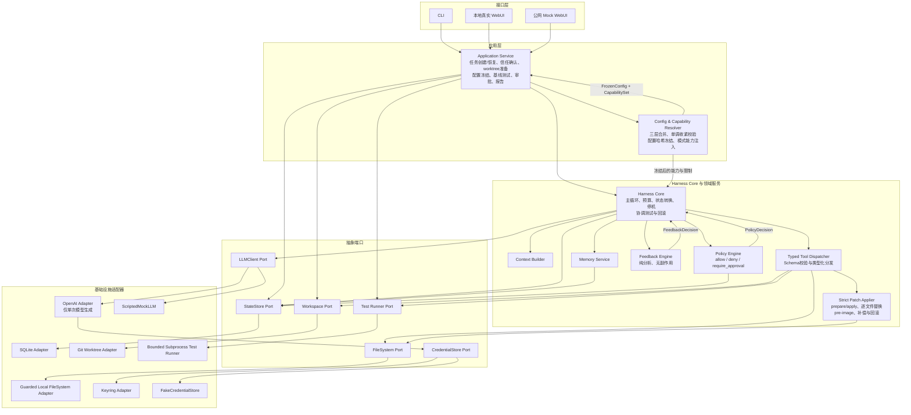
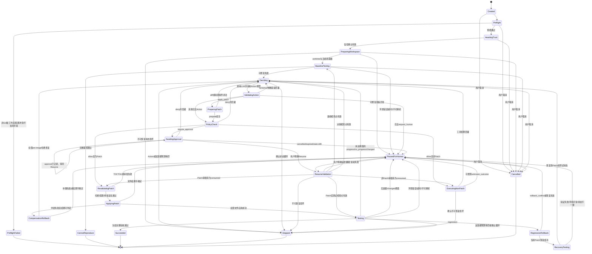
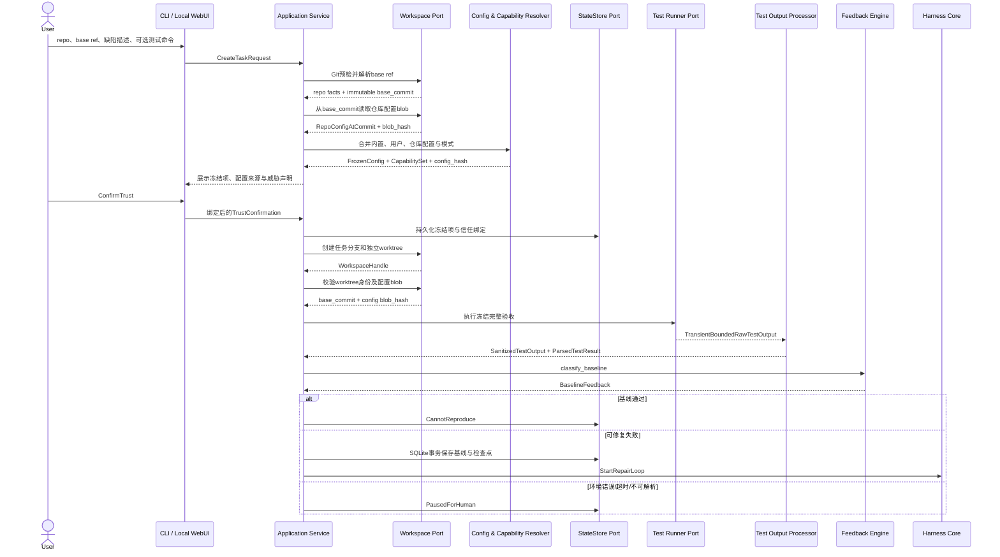
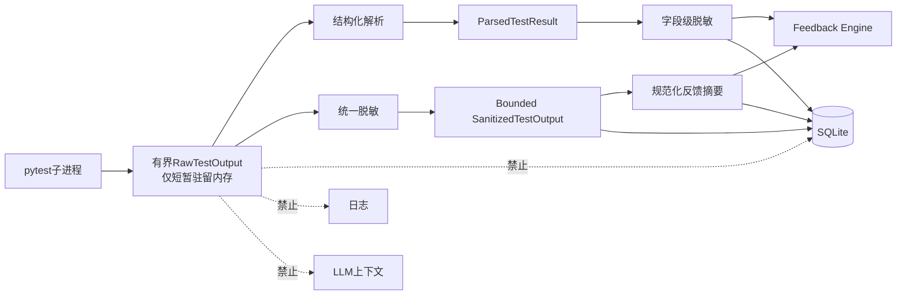
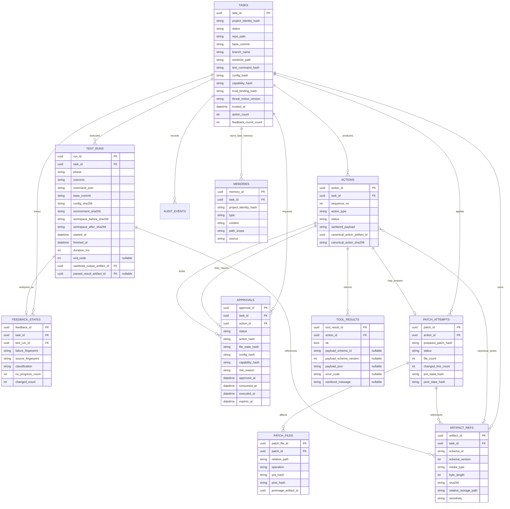

# Coding Agent Harness 规格说明

## 1. 文档目的

本文定义 AI4SE 期末项目 **A · Coding Agent Harness** 的首版产品与工程规格。它是后续实现计划、TDD、冷启动验证、代码评审和验收的唯一设计基线。

本项目交付一个自行实现主循环的本地 Python Coding Agent Harness。它不得建立在 LangChain `AgentExecutor`、AutoGen、CrewAI、LlamaIndex Agent、OpenAI Agents SDK、编码智能体 Agent Runner 或其他现成高层 Agent 循环之上。允许使用 LLM 供应商的单次生成 API、HTTP 客户端、Schema 库、diff 解析库等底层零件。

## 2. 问题陈述与目标用户

### 2.1 问题

学生和个人开发者经常能够描述 Python 项目中的缺陷，也能用 pytest 复现失败，但定位问题、修改源码、理解新的失败反馈并反复验证仍耗费大量时间。直接让 LLM 自主编辑和运行命令存在以下问题：

- LLM 可能跳过测试、误读结果或伪称完成；
- LLM 可能修改测试、放宽断言或改变 pytest 配置来制造伪通过；
- 通用 Shell、路径越界、敏感文件访问和大规模修改扩大安全风险；
- 无进展、回归和循环缺乏客观判定，容易无限消耗资源；
- 审批、崩溃恢复、凭据、记忆和审计通常只是提示词约定，无法确定性测试。

### 2.2 目标

构建一个面向本地、可信、Git 管理的 Python 代码库的 Coding Agent Harness。用户提供缺陷描述和可选 pytest 命令后，Harness：

1. 在隔离 Git worktree 中建立失败基线；
2. 组织上下文并调用一次 LLM 生成严格类型化 Action；
3. 通过代码实现的治理机制检查工具和 Patch；
4. 每次 Patch 完整成功后自动运行冻结的完整验收命令；
5. 解析 pytest 反馈并确定性判断通过、进展、无进展、变化、回归或循环；
6. 在测试通过、需要人工处理或达到不可继续的停机条件时终止。

项目价值不在于“让 LLM 写代码”，而在于用可测试、可恢复、可审计的 Harness 机制约束不确定的 LLM。

### 2.3 目标用户

- 使用 pytest 的 Python 学生项目维护者；
- 维护个人 Python 代码库的独立开发者；
- 希望研究 Agent 治理、反馈闭环和确定性测试的学习者。

### 2.4 成功定义

首版成功意味着：对于完整验收命令在基线 commit 上失败、且修复后应全部通过的可信 Python 仓库，Harness 能在不修改测试资产的前提下，以 Mock LLM 或真实 OpenAI 单次生成接口驱动受控修复，并且只有与当前文件状态绑定的冻结完整验收记录通过时才报告成功。

## 3. 用户故事

1. 作为 Python 项目维护者，我希望提供仓库、基础 ref、缺陷描述和可选 pytest 命令，以便创建边界明确的修复任务。
2. 作为谨慎的本地用户，我希望在执行目标代码前看到威胁声明并主动确认信任，以免误把 worktree 当作进程沙箱。
3. 作为开发者，我希望 Harness 先运行完整基线，以便无法复现时不调用 LLM、不修改代码。
4. 作为开发者，我希望每次 Patch 后自动运行冻结的完整验收，以便 LLM 无法跳过客观反馈。
5. 作为代码所有者，我希望测试和 pytest 配置不可修改，以免 Agent 篡改验收条件。
6. 作为安全审查者，我希望高影响 Action 暂停并展示风险、diff 和绑定哈希，以便作出一次性批准或拒绝。
7. 作为开发者，我希望明确回归的 Patch 自动回滚并验证恢复，以免错误改动累积。
8. 作为开发者，我希望无进展时可以暂停、循环或预算耗尽时确定性停止，以免无限消耗资源。
9. 作为返回项目的用户，我希望查看任务时间线、测试反馈、审批和历史决策，并在复验通过后安全恢复暂停任务。
10. 作为演示访问者，我希望在公网 WebUI 重放三个固定 Mock 场景，以便无需 Key 或本地仓库即可验证核心机制。

## 4. 范围

### 4.1 首版包含

- Git 管理且原工作区干净的本地 Python 仓库；
- OpenAI 单次生成适配器和 `ScriptedMockLLM`；
- 自行实现的主循环、上下文构造、Action 解析、工具分发、反馈回灌和停机；
- 类型化读取、搜索、Git 查看、诊断、局部测试、请求人工和 Patch 工具；
- pytest 基线、Patch 后自动完整验收、反馈分类、回归和循环检测；
- 测试保护、路径围栏、三级治理和一次性 HITL；
- 多文件 Patch 预验证、逐文件原子替换与补偿回滚；
- SQLite 状态、结构化记忆、审计和任务恢复；
- CLI、本地 WebUI 和三个公网 Mock 演示场景；
- keyring 凭据管理；
- PyPI/pipx 本地分发与 Docker/OCI 公网演示分发。

### 4.2 首版不包含

- 现成 Agent 主循环或高层 Agent 框架；
- 非 Git、脏工作区、非 Python或非 pytest 项目；
- 修改测试、pytest 配置或“审批后修改测试”；
- 不可信仓库沙箱、网络隔离或 Docker 测试执行；
- 任意 Shell、任意公网 Prompt或用户仓库上传；
- 二进制、符号链接、文件模式、子模块和复杂重命名 Patch；
- 自动 commit、merge、push、PR、发布或无确认清理；
- 多 Agent、并行任务执行、向量记忆和多个真实 LLM 供应商；
- 长期保留已知失败的基线、增量验收或大型测试套件优化。

## 5. 六个 Harness 维度与领域机制

| 维度 | 首版最低实现 | 确定性验证 |
|---|---|---|
| 决策封装 | Context Builder、`LLMClient`、严格 Action Schema、自研 Core 状态机 | Scripted Mock 输入记录、协议错误、预算和停机测试 |
| 动作／工具 | 类型化工具注册表、统一分发、严格参数和路径验证 | Fake Ports、工具契约和非法参数测试 |
| 上下文／记忆 | SQLite 结构化记忆、确定性检索、预算内注入 | 固定数据下排序和上下文快照测试 |
| 治理护栏 | 路径围栏、测试保护、三级决策、精确绑定和一次性 HITL | deny、approval、漂移、重复消费测试 |
| 反馈闭环（重点） | pytest 解析、脱敏摘要、状态指纹、进展／回归／循环判断、自动测试与回滚协调 | Fake Test Runner 故障注入和真实 pytest 集成链路 |
| 声明式配置 | 三层严格 TOML、单调收紧合并、FrozenConfig 与 CapabilitySet | 合并性质、冲突、未知字段和哈希测试 |

### 5.1 所需工具

首版 LLM 可请求以下类型化 Action：

- `list_files`
- `read_file`
- `search_code`
- `apply_patch`
- `run_tests`（仅冻结完整命令或受控局部 pytest）
- `git_diff`
- `git_status`
- `run_diagnostic`
- `request_human`

首版没有 `finish` Action。LLM 返回 `finish` 时按未知 Action 处理，消耗 Action 预算并产生结构化协议错误。

### 5.2 客观反馈信号

反馈来自 Harness 运行并解析的 pytest，而不是 LLM 自我评价。失败指纹由以下内容构成：

- pytest 阶段；
- 失败测试节点 ID 集合；
- 异常类型；
- 规范化错误摘要；
- 项目内关键栈帧。

源码指纹由允许修改的源码 diff 生成。摘要规范化移除绝对路径、时间戳、临时目录、ANSI 控制码和无关波动。

分类规则：

- `passed`：冻结完整验收明确通过；
- `progress`：失败集合严格减少且无新增失败，或从源码导致的收集／语法错误恢复为正常测试执行；
- `no_progress`：相同失败和相同源码，或源码变化但失败指纹持续不变；
- `changed`：状态变化但无法客观判断好坏，不重置无进展计数；
- `regression`：新增失败或产生新的语法／收集错误；
- `loop`：固定历史窗口内完整状态重现；
- `environment_error`／`unparseable`：不能交给 LLM 猜测。

### 5.3 危险动作

不可审批的硬拒绝包括测试资产修改、工作区越界、凭据访问、未知工具、非法 Schema、Shell 语法、二进制或符号链接 Patch，以及公网演示模式越权。合法但高影响的动作包括敏感源码路径、源码删除、超过审批阈值的 Patch 和依赖／构建配置修改，必须进入 HITL。

### 5.4 记忆

记忆类型至少包括：

- `project_rule`
- `user_constraint`
- `repair_summary`
- `human_decision`
- `known_issue`

字段至少包括 `type`、`content`、`tags`、`path_scope`、`source`、`created_at`、`task_id` 和 `project_identity_hash`。检索按项目身份、路径范围、标签、类型优先级和时间顺序确定性排序，只在固定条数及上下文预算内注入。记忆不能保存 Harness 凭据，不能作为命令执行，也不能由 LLM 以任意格式直接写入。

## 6. 总体架构

系统采用端口与适配器架构以及显式状态机。CLI、本地 WebUI 和公网演示 WebUI 统一调用 Application Service；唯一主循环位于 Harness Core。



### 6.1 组件职责

| 组件 | 核心职责 | 明确不负责 |
|---|---|---|
| Application Service | 创建／恢复任务、信任确认、准备 worktree、冻结配置、执行基线、处理审批、生成报告 | 不实现 Agent 主循环，不自行判断 pytest 进展 |
| Config & Capability Resolver | 合并三层配置、执行只能收紧规则、生成有效配置和能力哈希 | 不读取凭据，不执行工具，不接受 LLM 修改 |
| Harness Core | 实现主循环、预算、状态转换、审批协调、自动测试、回滚协调和停机 | 不直接依赖 SQLite、Git、keyring 或具体进程 API |
| Context Builder | 在预算内组合缺陷、代码、记忆、工具结果和反馈 | 不判断进展，不执行动作 |
| Policy Engine | 返回 `allow`、`deny` 或 `require_approval`，验证审批绑定 | 不执行 Action；StateStore 不替它作治理判断 |
| Typed Tool Dispatcher | 校验并分发已授权的类型化工具，统一包装结果 | 不实现 Patch、路径围栏或命令执行细节 |
| Feedback Engine | 纯分析 pytest 结果、摘要、指纹和历史，返回不可变 `FeedbackDecision` | 不写状态、不扣预算、不回滚、不调用 LLM |
| Memory Service | 校验、检索和预算内提供结构化记忆 | 不接受任意内容，不执行记忆 |
| Strict Patch Applier | 两阶段 Patch、事实计算、逐文件原子替换、pre-image 和回滚 | 不决定测试进展，不作 Policy 判断 |
| Workspace Port | 抽象 worktree、Git 状态、diff 和生命周期 | 不向 LLM 暴露任意 Git 命令 |
| FileSystem Port | 抽象受围栏保护的读、搜、哈希和文件操作 | 不允许绕过规范化和符号链接检查 |
| Test Runner Port | 冻结命令、环境清理、超时、输出限制和进程树终止 | 不判断修复是否进展 |
| StateStore Port | 持久化任务、Action、测试、审批、记忆、审计和意图日志 | 不作治理判断，不假设数据库事务覆盖文件系统 |
| LLMClient Port | 单轮输入到模型输出 | 不包含主循环、工具执行或状态管理 |
| CredentialStore Port | 设置、状态、更新和清除凭据 | 不向日志、数据库、子进程或模型暴露 Key |

## 7. 状态机与停机语义



### 7.1 状态语义

- 只有 `Deciding` 可以调用 LLM；调用前检查预算。
- 一次反馈轮次定义为测试完成、结果解析并回灌。
- 一次 Action 定义为 LLM 产生并由 Harness 处理的结构化动作；护栏拒绝、Schema 错误和非法参数也消耗预算。
- 默认最多 8 个反馈轮次、40 个 Action；连续 2 次无测试进展或 2 次不明确 `changed` 后暂停；历史窗口为 8。
- 完整状态循环一经确认立即进入 `Stopped`。
- 任一硬预算到达后不得再次调用 LLM，结果为“预算内未完成，需要创建新任务”，不得伪称成功。
- `PausedForHuman` 可恢复，但只能由用户明确请求进入 `ResumeValidation`。
- `ResumeValidation` 重新验证 worktree、base commit、FrozenConfig、文件哈希、安全检查点、锁／lease、Action 和 CapabilitySet。
- `Stopped` 不可恢复，只能审查报告并创建新任务。
- `Succeeded` 只能由与当前文件哈希、冻结命令和配置哈希对应的完整验收通过记录自动触发。

### 7.2 审批状态

审批记录至少具有 `pending`、`approved`、`consumed`、`executed`、`denied`、`cancelled` 和 `expired`。成功执行路径严格为 `pending → approved → consumed → executed`。批准只记录决定，不自动执行；用户必须另行明确 Resume。ResumeValidation 成功时，StateStore 才把有效批准原子转换为 `consumed`；工具完整结束后才转为 `executed`。拒绝不产生工具副作用，可返回 `Deciding` 并回灌拒绝结果。

审批绑定 `task_id`、规范化 Action、Patch 内容或引用、当前文件哈希、配置哈希、CapabilitySet 哈希、风险原因和一次性 Action 哈希。Action、文件、配置或能力变化后审批失效。StateStore 只持久化、转换状态和原子消费；Policy Engine 负责判断绑定是否有效。对需审批 Action，`ApprovalStatus.CONSUMED`、Action 最终持久化为 `ActionStatus.EXECUTING`、执行意图日志写入必须在同一 SQLite 事务中提交。事务可记录逻辑 `READY → EXECUTING` 事件，但不得暴露可恢复的 `consumed + READY` 持久化窗口；事务提交后才启动外部副作用。提交后若执行前或执行中崩溃，Action 必须进入 `UNKNOWN_OUTCOME`，审批保持 `CONSUMED`，不得重试、回退或再次消费。

## 8. 端到端数据流

### 8.1 启动与基线



必须先解析冻结 `base_commit`，再从该 commit 读取仓库配置。不能从当前工作树读取仓库配置后再确定基线。创建 worktree 后必须验证其 commit 和配置 blob 与冻结值一致。

### 8.2 Action 与工具

所有非 Patch 工具遵循：

`Schema 验证 → Policy → Typed Tool Dispatcher → ToolResult[ToolPayloadUnion] → 字段级脱敏 → SQLite 持久化 → 回灌`

`list_files`、`read_file`、`search_code`、`git_diff`、`git_status`、`run_diagnostic` 和局部 `run_tests` 都不能绕过 Policy。只有完整成功的 `apply_patch` 自动触发冻结完整验收；局部测试不能触发 `Succeeded`。

### 8.3 HITL

Core 创建 Pending Approval 后进入 `AwaitingApproval`。Application Service 从 StateStore 读取并通过 CLI 或 WebUI展示：

- 本地 WebUI 验证短期 Session、CSRF、精确 Host、精确 Origin、HTTP 方法和 Content-Type；
- CLI 使用本地交互式确认提交 `ApprovalDecision`，不使用浏览器安全字段；
- Human 不直接调用 Core；
- approve/deny 先持久化决定；approve 保持等待，直到用户明确 Resume；
- ResumeValidation 和绑定复验成功后，StateStore 在同一 SQLite 事务中写入审批 `consumed`、Action `executing` 和执行意图；事务提交后 Patch 才进入外部 Revalidating/Apply 路径，非 Patch 才启动工具；工具完整结束后才把审批转为 `executed`。
- 若审批已 `consumed` 而 Action 未形成确定结果，Action 标记为 `unknown_outcome`，任务进入 `PausedForHuman`；审批保持 `consumed`，不得自动重试或再次消费。

### 8.4 测试输出



未脱敏 Raw Test Output 只能短暂存在内存。`ParsedTestResult`、`ToolResult`、内部错误和结构化字段也必须字段级脱敏；结构化不等于安全。SQLite 的“原子持久化”仅指数据库事务，不包含文件或进程副作用。

## 9. Action 与 Patch 协议

### 9.1 Action

#### 9.1.1 公共结构与解析

| 项目 | 权威契约 |
|---|---|
| `ValidatedAction` | 公共、冻结、`extra="forbid"`、不可直接实例化的抽象基类 |
| 九个具体 Action | 均冻结、`extra="forbid"`；成功解析只返回其中一个具体子类 |
| `ActionUnion` | 内部判别联合，以 `type` 为 discriminator |
| `FinishAction` | 不存在；`finish` 按 `UNKNOWN_ACTION` 处理 |
| `parse_action` | `parse_action(raw: str | dict[str, object]) -> ValidatedAction | ProtocolError` |

字符串输入使用严格 JSON：拒绝尾随内容、重复键、`NaN`、`Infinity`、`-Infinity`；顶层必须为 object。直接 dict 至少浅复制顶层映射且不得修改调用者对象，嵌套值由冻结模型转换为自身不可变表示。运行时签名外类型返回 `INVALID_TOP_LEVEL`，不得抛出 `TypeError`。所有 JSON、Pydantic 和防御性解析异常均在函数内转换。`type` 必须为 `StrictStr` 并匹配 `^[a-z][a-z0-9_]{0,63}$`。

| 优先级 | 条件 | ProtocolErrorCode |
|---:|---|---|
| 1 | 字符串不是严格合法 JSON | `INVALID_JSON` |
| 2 | JSON 顶层不是 object，或运行时输入类型不受支持 | `INVALID_TOP_LEVEL` |
| 3 | object 缺少 `type` | `MISSING_TYPE` |
| 4 | `type` 不是 StrictStr 或不匹配结构正则 | `INVALID_TYPE` |
| 5 | 结构合法但不是九种已知 Action；包括 `finish` | `UNKNOWN_ACTION` |
| 6 | 已识别 Action 的字段、额外字段或跨字段约束失败 | `SCHEMA_VIOLATION` |

`ProtocolErrorCode` 使用 `@unique`；成员名大写、值为下表小写 snake_case；字符串输入只接受精确 `.value`，不 trim、不改大小写；JSON 输出 `.value`；测试比较 `.value` 且不依赖枚举顺序。

| 成员 | `.value` | `sanitized_message` 固定英文 ASCII |
|---|---|---|
| `INVALID_JSON` | `invalid_json` | `Action must be a valid JSON object.` |
| `INVALID_TOP_LEVEL` | `invalid_top_level` | `Action must be a JSON object.` |
| `MISSING_TYPE` | `missing_type` | `Action field 'type' is required.` |
| `INVALID_TYPE` | `invalid_type` | `Action field 'type' must match ^[a-z][a-z0-9_]{0,63}$.` |
| `UNKNOWN_ACTION` | `unknown_action` | `Action type is not supported.` |
| `SCHEMA_VIOLATION` | `schema_violation` | `Action fields do not match the required schema.` |

`ProtocolError` 冻结、`extra="forbid"`，仅含 `code: ProtocolErrorCode` 与 `sanitized_message: StrictStr`。消息不得包含原始输入、字段值、未知 Action 名、供应商异常或 Pydantic 细节。测试不得依赖 Pydantic 内部错误文本、位置格式或版本差异。协议错误形成结构化反馈并消耗 Action 预算，原始模型输出不能直接执行。

#### 9.1.2 公共路径契约

| 项目 | 约束 |
|---|---|
| 类型／长度 | `str`，1～4096 个 Unicode 字符 |
| 存在性 | `list_files`、`read_file`、`search_code` 均必填且无默认 |
| 根路径 | `.` 合法且必须显式提供 |
| Schema 拒绝 | 空字符串、NUL、明显绝对路径 |
| Schema 不做 | trim、路径规范化、内容改写、隐式默认 |
| 后续路径安全组件 | Windows 盘符、UNC、`..` 越界、符号链接、规范化，以及规范化后仍位于任务 worktree 根内 |

#### 9.1.3 九种 Action 字段表

##### ListFilesAction

| 字段 | 类型 | 必填／默认 | 约束 |
|---|---|---|---|
| `type` | `Literal["list_files"]` | 必填 | discriminator |
| `path` | `str` | 必填、无默认 | §9.1.2 |
| `recursive` | `StrictBool` | 必填、无默认 | 拒绝 0/1、字符串及其他布尔转换 |

不提供 `max_depth`、`limit`、`glob`。结果数量、输出字节、截断和资源上限由工具实现及 `FrozenConfig` 控制。

##### ReadFileAction

| 字段 | 类型 | 必填／默认 | 约束 |
|---|---|---|---|
| `type` | `Literal["read_file"]` | 必填 | discriminator |
| `path` | `str` | 必填、无默认 | §9.1.2 |
| `start_line` | `StrictInt | None` | 默认 `None` | 与 end 同时提供或省略 |
| `end_line` | `StrictInt | None` | 默认 `None` | 与 start 同时提供或省略 |

| start/end | 结果 |
|---|---|
| 均为 `None` | 从文件开头读取，仍受冻结行数、字节数和截断限制 |
| 仅一个存在 | `SCHEMA_VIOLATION` |
| 均存在且 `1 <= start_line <= end_line <= 1_000_000` | 从 1 开始的包含式范围 |
| bool、浮点、数字字符串或越界 | `SCHEMA_VIOLATION` |

Action 不指定编码、错误策略或输出上限；文件类型、路径、符号链接安全由文件系统组件处理。具体 ReadFilePayload 后续须定义 `truncated` 和可继续读取位置，Task 2 不提前定义真实 payload。

##### SearchCodeAction

| 字段 | 类型 | 必填／默认 | 约束 |
|---|---|---|---|
| `type` | `Literal["search_code"]` | 必填 | discriminator |
| `path` | `str` | 必填、无默认 | §9.1.2 |
| `query` | `StrictStr` | 必填、无默认 | 1～1000 Unicode；非纯空白；拒绝 NUL、CR、LF；内部普通空格允许；始终 literal |
| `case_sensitive` | `StrictBool` | 必填、无默认 | 拒绝类型转换 |

path 为目录时固定递归，为文件时仅搜索该文件。不提供 `regex`、`recursive`、`glob`、`max_results`、`context_lines` 或输出上限。工具任务必须先冻结文件筛选、隐藏文件、Git ignore、二进制检测、确定性排序、上下文行与截断规则。

##### ApplyPatchAction

| 字段 | 类型 | 必填／默认 | 约束 |
|---|---|---|---|
| `type` | `Literal["apply_patch"]` | 必填 | discriminator |
| `diff` | `StrictStr` | 必填、无默认 | 完整内联单次逻辑 unified diff，可含多文件 |

| diff 协议 | 约束 |
|---|---|
| 内容 | 非空、非纯空白；拒绝 NUL、CR；只允许 LF；必须以 LF 结尾 |
| 编码／大小 | 必须严格编码 UTF-8，拒绝孤立 surrogate；1～2,097,152 字节 |
| 稳定性 | 不 trim、不规范化、不改写；原始字符串及字节序列保持稳定，参与后续 Action 哈希与审批绑定 |
| Task 2 不做 | 不解析 header、hunk、路径；违反即 ProtocolError，不进入 Policy 或 `prepare(diff)` |
| 后续 prepare | unified diff 解析、路径规范化、hunk、前置哈希、PatchFacts、pre-image、风险和审批绑定 |

LLM 不得提交 `artifact_ref`、`path`、`files`、`reason`、`approval`、`base_hash`、Patch 模式或可调安全上限。内部持久化可把精确 diff 转为受限 Patch 工件引用和 SHA-256，但不改变 LLM 协议或原始字节。此处不定义 canonical JSON 算法。

##### RunTestsAction

| 字段 | 类型 | 必填／默认 | 约束 |
|---|---|---|---|
| `type` | `Literal["run_tests"]` | 必填 | discriminator |
| `scope` | `Literal["full", "focused"]` | 必填、无默认 | 精确值 |
| `targets` | `tuple[StrictStr, ...]` | 必填、无默认 | JSON 必须为数组，验证后为 tuple |

| scope | targets | 语义 |
|---|---|---|
| `full` | 必须为空 | 只能执行冻结完整验收命令 |
| `focused` | 必须非空 | 受控 pytest target；绝不能触发 `Succeeded` |

不提供 `command`、`argv`、`cwd`、`env`、`timeout`、`parallel`、`markers`、`keyword` 或输出限制。Patch 后完整测试由 Core 自动触发，LLM 不能跳过或替代。主动 requested-full 是否可绑定当前文件哈希与冻结配置后触发成功，由后续状态机契约确定。

| Focused target 项目 | 规则 |
|---|---|
| 数量／长度 | 1～32 项；每项 1～4096 Unicode；严格 UTF-8、拒绝孤立 surrogate；总 UTF-8 <=32,768 字节 |
| 通用拒绝 | 空、纯空白、NUL、CR、LF、以 `-` 开头、`.`、glob、pytest flags、完全重复 |
| 稳定性 | 不去重、不排序；保留输入顺序和原字符串并参与 canonical Action |
| PATH | 非空、相对 `.py` 文件路径；不得纯空白或有首尾 Unicode 空白；拒绝 NUL、CR、LF、`::`、明显绝对路径及调用者包裹引号；内部 U+0020 允许 |
| 节点 | 可省略；否则一个或多个非空 SELECTOR，以 `::` 分隔；每段须 `str.isidentifier()`，不得有空段或单独 `:` |
| 参数化 | 仅最后 selector 可有一个最终 `[PARAM_ID]`；须已有 selector；PARAM_ID 为 1～512 Unicode，拒绝 `[`, `]`, NUL, CR, LF，允许空格、`::`、Shell 元字符；拒绝多后缀或 `]` 后内容 |
| 执行 | target 始终作为一个 argv 元素，`shell=False`，不经 Shell、转义或命令解释 |
| 后续组件 | Windows 盘符、UNC、`..`、规范化、符号链接、最终根内检查及受保护测试资产归属 |

##### GitDiffAction 与 GitStatusAction

| Action | 字段 | 固定语义 |
|---|---|---|
| `GitDiffAction` | 仅 `type: Literal["git_diff"]` | 比较冻结 `base_commit` 与任务 worktree；覆盖允许源码 staged、unstaged、新增文件；未跟踪文件生成确定性 synthetic unified diff |
| `GitStatusAction` | 仅 `type: Literal["git_status"]` | 返回任务 worktree 的结构化状态 |

两者不得接受 `ref`、`commit`、`range`、`pathspec`、`staged`、`stat`、porcelain 版本、ignored/untracked 开关或其他 Git 参数；不得读取任意 Git 历史。状态分类、重命名表示、路径排序、脱敏与截断由 Workspace 工具契约定义。

##### RunDiagnosticAction

| 字段 | 类型 | 必填／默认 | 约束 |
|---|---|---|---|
| `type` | `Literal["run_diagnostic"]` | 必填 | discriminator |
| `diagnostic_id` | `StrictStr` | 必填、无默认 | 1～64 ASCII；`^[a-z][a-z0-9_]{0,63}$`；不 trim、不改大小写 |
| `arguments` | `tuple[StrictStr, ...]` | 必填、无默认 | JSON 数组转 tuple；无参数显式 `[]` |

arguments 为 0～32 项；单项 0～4096 Unicode，允许空串，严格 UTF-8、拒绝孤立 surrogate、NUL、CR、LF；总 UTF-8 <=32,768 字节。不因 `-`、空格或 Shell 元字符通用拒绝；不 trim、排序、去重、展开环境变量或规范化路径；精确顺序和内容参与 canonical Action。

LLM 不得提供 `command`、完整 `argv`、executable、`shell`、`cwd`、`env` 或 `timeout`。ID 只引用启动时冻结在 `FrozenConfig`/`CapabilitySet` 的模板；模板固定 executable、固定参数、变量参数 Schema、cwd、清理环境、超时、输出和资源限制。未知或当前模式不可用 ID 由 Capability/Policy 稳定拒绝且不启动进程。仓库配置只能禁用或收紧已有模板。处理顺序为通用协议 → Capability → 模板参数 Schema → Policy → `shell=False` 执行。

##### RequestHumanAction

| 字段 | 类型 | 必填／默认 | 约束 |
|---|---|---|---|
| `type` | `Literal["request_human"]` | 必填 | discriminator |
| `reason` | `StrictStr` | 必填、无默认 | 同时说明自动流程不能安全继续的原因和需要人工处理的事项 |

reason 为 1～4000 Unicode、UTF-8 <=16,384 字节，必须严格编码并拒绝孤立 surrogate；不得为空、纯空白或有首尾 Unicode 空白；允许内部普通空格和 LF；拒绝 CR、U+2028、U+2029 及除 LF 外全部 Unicode Cc（包括 NUL、TAB、ESC、DEL、C1）。不做 Unicode normalization、Markdown/HTML 解析或内容改写；精确原文参与 canonical Action。字段级脱敏生成独立安全展示／持久化副本，不替代原始 Action 哈希；UI 按输出上下文 HTML escaping。

不提供 `question`、`choices`、`kind`、`approval_action_hash`、`resume_state` 或自由 payload；不自动创建工具或 Patch 审批，也不能指定恢复状态或绕过 ResumeValidation。Application Service 的后续输入不修改原 Action。成功触发 `PausedForHuman` 时该 Action 记为 `ActionStatus.SUCCEEDED`，且不进入外部工具副作用窗口。

### 9.2 测试命令与 FrozenCommand

- 用户显式命令优先，声明式默认命令兜底；任务启动时解析、校验并冻结。
- LLM 不能替换、取消或跳过完整命令；局部测试受控且不参与最终成功判定。

| 字段 | 类型 | 必填／默认 |
|---|---|---|
| `argv` | `tuple[StrictStr, ...]` | 必填、无默认；JSON 必须为数组，验证后为 tuple |

`FrozenCommand` 冻结、`extra="forbid"`，且不含拼接命令、cwd、env、timeout、shell、配置哈希、来源或派生哈希。只允许大小写敏感逻辑前缀 `("pytest", *pytest_args)` 或 `("python", "-m", "pytest", *pytest_args)`；拒绝 python.exe、python3、py、绝对 executable 和模块别名。逻辑标识由冻结执行上下文解析到任务绑定的受信解释器／入口，不得通过任意 PATH 选择。

argv 为 1～64 项；每项为非空 StrictStr、1～4096 Unicode；总 UTF-8 <=32,768 字节；严格 UTF-8并拒绝孤立 surrogate、NUL、CR、LF、首尾 Unicode 空白；允许内部普通空格；不规范化、排序、去重或展开环境变量。精确顺序和内容进入后续 canonical JSON。pytest 参数规则由命令冻结组件执行；用户文本中的管道、重定向、连接和命令替换在形成 FrozenCommand 前拒绝。模型只能由任务启动／配置解析流程创建，不能来自 LLM；执行逐元素传参并固定 `shell=False`。canonical JSON 精确算法仍归 Task 8。
### 9.3 Strict Patch Applier 两阶段 API

`prepare(diff)`：

- 完整解析 strict unified diff；
- 规范化路径；
- 精确验证 hunk、前置哈希和上下文；
- 计算文件数、增加＋删除行数、路径分类、操作类型等 `PatchFacts`；
- 生成不可变 `PreparedPatch`；
- 不产生文件副作用。

Policy Engine 根据 `PreparedPatch`、`PatchFacts`、FrozenConfig 和审批记录作出 `allow`、`deny` 或 `require_approval`。Patch 组件负责事实，Policy 负责规则判断。

`apply(prepared_patch)`：

- 仅在 allow 或有效一次性审批后调用；
- 写入前再次验证 Action、Patch、目标哈希、配置和审批绑定；
- 先持久化意图日志和 pre-image；
- 每个文件采用同目录临时文件和原子替换逐一写入；
- 不承诺多文件整体原子性；
- 全部文件成功后才触发完整 pytest。

### 9.4 Patch 支持边界

支持 UTF-8 普通文本文件的精确多文件修改、创建，以及经 HITL 的源码删除。不支持二进制、权限／模式、符号链接、子模块、模糊匹配、offset、fuzz 和复杂重命名。拒绝绝对路径、Windows 盘符、`..`、NUL、越界及任何符号链接路径。

### 9.5 应用失败与测试回归

| 类型 | 触发 | 恢复 | 测试 |
|---|---|---|---|
| 应用失败补偿 | Patch 写入中途失败且结果可判定 | 恢复本轮全部 pre-image 并验证哈希 | 不运行 pytest；回灌 `apply_failure` |
| 测试回归回滚 | Patch 完整成功但产生新增失败或新语法／收集错误 | 验证 post-image 后恢复本轮 pre-image | 自动运行 `recovery_test_run` |

回滚禁止使用 `git reset --hard`。若当前文件不匹配预期 post-image，标记冲突并暂停，不得覆盖。Recovery Test 不计新的 LLM 修复轮次，且必须恢复到 Patch 前失败状态。

## 10. 功能需求

### 10.1 任务启动

- **FR-001** 输入必须包括原始仓库路径、base ref 和缺陷描述，并可包含显式 pytest 命令。
- **FR-002** 必须验证 Git 和干净状态、冻结 commit、从该 commit 读取仓库配置、合并配置、展示信任声明并创建任务 worktree。
- **FR-003** 启动输出必须包含任务 ID、分支、worktree、冻结项和启动报告。
- **FR-004** 非 Git、脏状态、无效 ref、配置冲突或未确认信任时不得调用 LLM。

任务分支格式为 `harness/fix-<task-id>`。所有工具以任务 worktree 为根。Harness 不自动 merge、push、发布或清理。

### 10.2 基线

- **FR-005** 首次 LLM 调用前必须运行完整冻结命令；若通过则进入 `CannotReproduce`，不调用 LLM、不修改文件。
- **FR-006** 源码导致的语法／收集错误可进入修复；解释器或 pytest 缺失、权限、超时或不可解析结果必须暂停。

- **FR-007** 基线必须记录 base commit、命令和配置哈希、脱敏环境摘要、退出码、统计、失败指纹、耗时和脱敏截断摘要。

### 10.3 自动反馈循环

- **FR-008** 一次逻辑 Patch 可包含多个允许源码文件；完整成功后 Core 必须自动进入 testing。
- **FR-009** 完整验收结束并产生反馈前必须禁止另一个 Patch。
- **FR-010** Feedback Engine 必须无副作用；Core 必须管理预算、状态、回滚和停机，并处理全部 `FeedbackDecision`。

### 10.4 治理

- **FR-011** Policy Engine 必须对规范化 Action 产生三级结果：

- `allow`：普通源码内的小规模修改和安全只读／诊断；
- `deny`：不可突破的硬边界；
- `require_approval`：合法但高影响的精确 Action。

- **FR-012** 默认 Patch 超过 5 个文件或 300 个新增＋删除行需审批；超过 20 个文件、2,000 行或单文件 1 MiB 必须硬拒绝。创建、删除和重命名均计入文件数，审批不能突破硬上限。
- **FR-013** 批准必须保持 `AwaitingApproval`，直到用户明确 Resume；有效审批在全面复验后只能原子消费一次。

### 10.5 测试保护

- **FR-014** Agent 可读取并运行测试，但不能创建、修改、移动或删除：

- `tests/**`
- `**/test_*.py`
- `**/*_test.py`
- `**/conftest.py`
- `pytest.ini`
- `tox.ini`
- `pyproject.toml`
- `setup.cfg`

- **FR-015** 首版必须保守保护整个 `pyproject.toml` 和 `setup.cfg`。如果 LLM 判断测试有误，必须 `request_human`，不得修改。

### 10.6 worktree 生命周期

- **FR-016** Harness 必须从用户选择的 base ref 冻结 commit，并创建独立任务分支和 worktree。
- **FR-017** 成功、失败、暂停或停止后必须保留分支、worktree、diff 和测试报告；清理只能由用户明确触发，且不得触碰原始工作区或其他任务。

### 10.7 任务恢复

- **FR-018** 每个 worktree 只允许一个活动任务，每任务只有一个执行者，并以锁或 lease 约束。
- **FR-019** 文件副作用必须使用意图日志；崩溃遗留的 executing Action 必须标记为 `interrupted/unknown_outcome`，不得自动重试。
- **FR-020** 重启后默认只允许查看；只有明确 Resume 并完成全面复验后才能继续。

### 10.8 记忆、凭据与接口

- **FR-021** Memory Service 必须校验结构化记忆并确定性检索，在固定预算内注入。
- **FR-022** CredentialStore 必须支持 Key 的隐藏录入、状态查询、更新和清除，且状态不得回显明文。
- **FR-023** CLI、本地 WebUI 和公网演示必须调用同一 Application Service 和 Core，不得重复实现主循环。
- **FR-024** 公网演示只能运行三个后端预置、可重置的 Mock 场景，不能接受任意 Prompt、仓库、路径、Patch 或命令。

## 11. 数据模型

### 11.1 通用模型规则、TaskId 与 ArtifactRef

本节“字段全部必填且无默认”的总则仅适用于 SPEC §11 的模型，不适用于 SPEC §9 Action；§9 的必填性和默认值只由各 Action 字段表决定。除表格明确可空字段外，§11 模型字段全部必填且无默认；模型冻结并 `extra="forbid"`。StrictInt 拒绝 bool、浮点和数字字符串。公共 path 继续使用 §9.1.2 已确认的 `str` 契约，Task 2 Red 不得擅自加入 StrictStr 专属断言。

#### TaskId

| 字段 | 类型 | 约束 |
|---|---|---|
| `value` | `UUID` | RFC 4122 variant UUIDv4；Python UUID 对象或规范小写连字符字符串 |

字符串必须与解析后 `str(uuid)` 完全一致，不静默规范化；拒绝 nil、其他版本、无连字符、大写、花括号、整数和 bytes。JSON 固定输出小写连字符字符串。Task ID 由 Application Service 使用安全随机 UUIDv4 生成，不由 LLM Action 提供。

#### ArtifactRef

| 字段 | 类型 | 约束 |
|---|---|---|
| `artifact_id` | `UUID` | 规范 RFC 4122 UUIDv4 |
| `task_id` | `TaskId` | 工件所属任务 |
| `schema_id` | `StrictStr` | `^[a-z][a-z0-9_.]{0,127}$` |
| `schema_version` | `StrictInt` | 1～65535 |
| `media_type` | `StrictStr` | 无参数、小写 type/subtype；`^[a-z0-9][a-z0-9!#$&^_.+-]{0,63}/[a-z0-9][a-z0-9!#$&^_.+-]{0,63}$` |
| `byte_length` | `StrictInt` | 0～2^63-1；精确、未压缩 canonical artifact 字节数 |
| `sha256` | `StrictStr` | 精确 canonical 字节的 64 位小写十六进制摘要 |

ArtifactRef 不含路径、URI、时间、生命周期、压缩、权限、存储实现或内联内容；`artifact_id` 不要求由内容哈希生成。ArtifactStore 加载时必须先验证任务所有权、byte length、SHA-256、Schema 和 media type，失败时不得反序列化。

### 11.2 ToolPayload、ToolResult 与 ToolErrorCode

`ToolPayload` 是冻结、`extra="forbid"`、不可直接实例化的抽象基类。各工具任务在实现前定义自己的具体、冻结 ToolPayload 子类；禁止 dict、list、Any 或无 Schema JSON。RequestHuman 是否存在工具结果由 Dispatcher／状态机任务决定，Task 2 不预设 payload。
Task 2 定义 `PayloadT = TypeVar("PayloadT", bound=ToolPayload)`；`ToolResult[PayloadT]` 用于一个具体工具的结果。Task 6 在全部具体 payload 定义后建立封闭 `ToolPayloadUnion`，异构 Dispatcher 返回 `ToolResult[ToolPayloadUnion]`。

| ToolResult 字段 | 类型 | 必填／默认 |
|---|---|---|
| `ok` | `StrictBool` | 必填、无默认 |
| `payload` | `PayloadT | None` | 必填、无默认 |
| `error_code` | `ToolErrorCode | None` | 必填、无默认 |
| `sanitized_message` | `StrictStr | None` | 必填、无默认 |

| `ok` | payload | error_code | sanitized_message |
|---|---|---|---|
| `True` | 必须为具体 ToolPayload；无数据成功使用显式空 payload 子类 | 必须 `None` | 必须 `None` |
| `False` | 必须 `None` | 必须存在 | 必须为符合下述约束的非空 StrictStr |
对 `run_tests`，只要 Harness 能形成并安全持久化完整可信的 TestRun，Dispatcher 就返回成功 ToolResult，即使 TestRunOutcome 为 TIMED_OUT、RESOURCE_LIMIT、ENVIRONMENT_ERROR、UNPARSEABLE、CANCELLED、UNKNOWN_OUTCOME 或 WORKSPACE_DRIFT。只有无法形成完整可信 TestRun 时才返回失败 ToolResult，例如请求非法、路径／安全拒绝、状态冲突、工件写入或完整性失败。不得用 ToolErrorCode 取代已经可靠形成的 TestRunOutcome。

`ToolErrorCode` 使用 `@unique`、禁止别名；成员名大写、值小写 snake_case；字符串只接受精确 `.value`，不 trim、不改大小写；JSON 输出和测试比较 `.value`；定义顺序无业务意义。

| 成员 | `.value` | 语义边界 |
|---|---|---|
| `INVALID_REQUEST` | `invalid_request` | 已进入工具边界但请求不满足工具专属契约 |
| `NOT_FOUND` | `not_found` | 目标确定不存在 |
| `SAFETY_VIOLATION` | `safety_violation` | 工具安全检查拒绝；Policy deny 不在 ToolResult |
| `UNSUPPORTED` | `unsupported` | 请求合法但工具不支持 |
| `CONFLICT` | `conflict` | 可以确定没有安全完成当前操作，不是未知结果 |
| `TIMEOUT` | `timeout` | 工具超过冻结超时 |
| `RESOURCE_LIMIT` | `resource_limit` | 触及冻结资源限制；正常可用截断仍是成功 payload |
| `ENVIRONMENT_ERROR` | `environment_error` | 受信环境阻止执行 |
| `EXECUTION_FAILED` | `execution_failed` | 工具确定执行失败；可解析 pytest 失败是正常 TestRun payload，不用此码 |
| `UNKNOWN_OUTCOME` | `unknown_outcome` | 副作用结果无法判断；禁止自动重试 |

Policy deny、待审批和协议错误不进入 ToolResult。失败 `sanitized_message` 为 1～2000 Unicode、UTF-8 <=8192 字节，严格编码、拒绝孤立 surrogate；不得为空、纯空白、有首尾 Unicode 空白、CR、LF、U+2028、U+2029 或任何 Unicode Cc；不做 normalization、Markdown/HTML 解析或改写。每个工具必须有至少由 `(tool_type, ToolErrorCode, stable_reason_key)` 确定的封闭固定英文 ASCII 模板，只插入规则化、脱敏、限长安全值。禁止底层异常、stderr、进程输出、绝对路径、环境变量、凭据、模型输出或堆栈。字段级脱敏必须在最终 ToolResult 创建前完成；相同规范化输入、工具版本和原因逐字符稳定；SQLite、日志和 LLM 使用同一安全消息，UI 仅额外上下文转义。

### 11.3 TestRun

TestRun 是一次测试执行完成后的冻结、已脱敏、有界、可持久化记录，不等于 subprocess 返回值，也不聚合 progress/regression/cycle。它不直接嵌入 SanitizedTestOutput 或 ParsedTestResult，不含未脱敏 stdout/stderr、BoundedRawOutput、进程／句柄、进程控制对象、底层异常或跨运行判断。TestExecution 是 Task 9 瞬时结果；SanitizedTestOutput 是安全工件内容；ParsedTestResult 是 Task 10 结构化解析内容；FeedbackDecision 是独立跨运行分析。

| 字段 | 类型 | 约束 |
|---|---|---|
| `run_id` | `UUID` | 规范 UUIDv4 |
| `task_id` | `TaskId` | 任务绑定 |
| `phase` | `TestPhase` | 下表封闭枚举 |
| `outcome` | `TestRunOutcome` | 下表封闭枚举 |
| `command` | `FrozenCommand` | 冻结测试命令 |
| `base_commit` | `StrictStr` | 40 或 64 位小写十六进制 |
| `config_sha256` | `StrictStr` | 64 位小写十六进制 |
| `environment_sha256` | `StrictStr` | 64 位小写十六进制 |
| `workspace_before_sha256` | `StrictStr` | 64 位小写十六进制 |
| `workspace_after_sha256` | `StrictStr` | 64 位小写十六进制 |
| `started_at` | `datetime` | 原生 UTC zero-offset |
| `finished_at` | `datetime` | 原生 UTC zero-offset，且不早于 started |
| `duration_ms` | `StrictInt` | 0～2^63-1，单调时钟耗时 |
| `exit_code` | `StrictInt | None` | 必填、显式可空；见矩阵 |
| `sanitized_output_ref` | `ArtifactRef` | 必须存在；同 task；`sanitized_test_output` v1；`application/json` |
| `parsed_result_ref` | `ArtifactRef | None` | 必填、显式可空；可靠且字段级脱敏后才存在；同 task；`parsed_result` v1；`application/json` |

`TestPhase` 与 `TestRunOutcome` 均使用 `@unique` 及统一枚举输入／序列化规则。

| TestPhase 成员 | `.value` |
|---|---|
| `BASELINE` | `baseline` |
| `FOCUSED` | `focused` |
| `POST_PATCH` | `post_patch` |
| `RECOVERY` | `recovery` |
| `RESUME_VALIDATION` | `resume_validation` |
| `REQUESTED_FULL` | `requested_full` |

主动 requested-full 是否可绑定当前文件状态与冻结配置后触发成功，由后续状态机契约确定。

| TestRunOutcome | `.value` | exit_code | parsed_result_ref | workspace hash |
|---|---|---|---|---|
| `PASSED` | `passed` | 必须严格为 0 | 必须存在且可靠 | before = after |
| `FAILED` | `failed` | 必须存在且非 0 | 必须存在且可靠 | before = after |
| `TIMED_OUT` | `timed_out` | 必须 `None` | `None` | before = after |
| `RESOURCE_LIMIT` | `resource_limit` | 可存在或 `None` | `None` | before = after |
| `ENVIRONMENT_ERROR` | `environment_error` | 可存在或 `None` | `None` | before = after |
| `UNPARSEABLE` | `unparseable` | 必须存在，但不得据值猜测通过 | `None` | before = after |
| `CANCELLED` | `cancelled` | 必须 `None` | `None` | before = after |
| `UNKNOWN_OUTCOME` | `unknown_outcome` | 必须 `None` | `None` | before = after |
| `WORKSPACE_DRIFT` | `workspace_drift` | 可存在或 `None` | 必须 `None` | before != after |

只要 governed workspace before/after 不一致，outcome 必须且只能是 WORKSPACE_DRIFT，不得记为 PASSED、FAILED 或 UNKNOWN_OUTCOME；漂移可在正常退出或异常中止后检测，Core 转人工处理。其他 outcome 必须具有相同 before/after hash。时间不接受非零时区后静默转换；canonical JSON 时间统一 `Z`。原始测试输出不得创建 ArtifactRef 或进入 ArtifactStore/SQLite。Feedback Engine 加载安全工件前验证引用、任务所有权、长度、摘要、Schema 和媒体类型。

### 11.4 FeedbackDecision

| 字段 | 类型 | 约束 |
|---|---|---|
| `kind` | `FeedbackKind` | 下表封闭枚举 |
| `current_run_id` | `UUID` | 规范 UUIDv4 |
| `previous_run_id` | `UUID | None` | 必填、显式可空；见矩阵 |
| `matched_history_run_id` | `UUID | None` | 必填、显式可空；见矩阵 |
| `state_fingerprint_sha256` | `StrictStr | None` | 必填、显式可空；见矩阵 |
| `sanitized_summary` | `StrictStr` | 下述安全消息约束 |

| FeedbackKind | `.value` | previous_run_id | matched_history_run_id | state fingerprint |
|---|---|---|---|---|
| `PASSED` | `passed` | 可为 `None` | 必须 `None` | 必须为 64 位小写 SHA-256 |
| `PROGRESS` | `progress` | 必须存在且不同 current | 必须 `None` | 必须存在 |
| `NO_PROGRESS` | `no_progress` | 必须存在且不同 current | 必须 `None` | 必须存在 |
| `CHANGED` | `changed` | 必须存在且不同 current | 必须 `None` | 必须存在 |
| `REGRESSION` | `regression` | 必须存在且不同 current | 必须 `None` | 必须存在 |
| `LOOP` | `loop` | 必须存在且不同 current | 必须存在且不同 current | 必须存在，并与 matched history 指纹完全相同 |
| `ENVIRONMENT_ERROR` | `environment_error` | 可为 `None`，但此类 run 不得成为后续 previous | 必须 `None` | 必须 `None` |
| `UNPARSEABLE` | `unparseable` | 可为 `None`，但此类 run 不得成为后续 previous | 必须 `None` | 必须 `None` |

ENVIRONMENT_ERROR 和 UNPARSEABLE 不参与进展、回归、无进展或循环历史，也不能成为后续 matched history。PASSED 指纹使用明确 canonical passed marker 与允许源码状态，不伪造失败集合。`FeedbackKind` 使用 `@unique` 和统一枚举规则。

`sanitized_summary` 为 1～2000 Unicode、UTF-8 <=8192 字节，严格编码并拒绝孤立 surrogate；非空、非纯空白、无首尾 Unicode 空白、单行；拒绝 CR、LF、U+2028、U+2029 和全部 Unicode Cc；不做 normalization 或标记解析。使用稳定固定英文 ASCII 模板和安全限长替换；不得含 Core 指令、计数器、内联证据或底层异常；UI 另做上下文转义。

### 11.5 TaskStatus、ActionStatus、PolicyOutcome 与 ApprovalStatus

本节四个枚举均使用 `@unique`：成员名大写、序列化值小写 snake_case；禁止别名和重复值；字符串只接受精确 `.value`，不 trim、不改大小写；JSON 仅输出 `.value`；业务逻辑不得依赖定义顺序。

#### TaskStatus

TaskStatus 严格等于 SPEC §7 状态图除 Mermaid `[*]` 外的 24 个具名状态；§7 是含义与转换的权威来源。

| 成员 | `.value` | SPEC §7 状态 |
|---|---|---|
| `CREATED` | `created` | Created |
| `PREFLIGHT` | `preflight` | Preflight |
| `AWAITING_TRUST` | `awaiting_trust` | AwaitingTrust |
| `PREFLIGHT_FAILED` | `preflight_failed` | PreflightFailed |
| `PREPARING_WORKSPACE` | `preparing_workspace` | PreparingWorkspace |
| `BASELINE_TESTING` | `baseline_testing` | BaselineTesting |
| `CANNOT_REPRODUCE` | `cannot_reproduce` | CannotReproduce |
| `DECIDING` | `deciding` | Deciding |
| `VALIDATING_ACTION` | `validating_action` | ValidatingAction |
| `PREPARING_PATCH` | `preparing_patch` | PreparingPatch |
| `POLICY_CHECK` | `policy_check` | PolicyCheck |
| `AWAITING_APPROVAL` | `awaiting_approval` | AwaitingApproval |
| `RESUME_VALIDATION` | `resume_validation` | ResumeValidation |
| `REVALIDATING_PATCH` | `revalidating_patch` | RevalidatingPatch |
| `APPLYING_PATCH` | `applying_patch` | ApplyingPatch |
| `COMPENSATION_ROLLBACK` | `compensation_rollback` | CompensationRollback |
| `EXECUTING_NON_PATCH` | `executing_non_patch` | ExecutingNonPatch |
| `TESTING` | `testing` | Testing |
| `SUCCEEDED` | `succeeded` | Succeeded |
| `REGRESSION_ROLLBACK` | `regression_rollback` | RegressionRollback |
| `RECOVERY_TESTING` | `recovery_testing` | RecoveryTesting |
| `PAUSED_FOR_HUMAN` | `paused_for_human` | PausedForHuman |
| `STOPPED` | `stopped` | Stopped |
| `CANCELLED` | `cancelled` | Cancelled |

不增加 RUNNING、FAILED、INTERRUPTED、UNKNOWN_OUTCOME、ENVIRONMENT_ERROR 或 WORKSPACE_DRIFT；审批、Action 生命周期、测试结果和转换原因分别属于其他类型。

#### ActionStatus

| 成员 | `.value` | 含义边界 |
|---|---|---|
| `RECEIVED` | `received` | 已接收并分配审计顺序，尚未完成协议验证 |
| `VALIDATED` | `validated` | 已解析为具体 Action，尚未完成 prepare/Capability/Policy |
| `AWAITING_APPROVAL` | `awaiting_approval` | 等待审批决定或 approved 后显式 Resume |
| `READY` | `ready` | 逻辑过渡状态：已获 allow，或审批复验成功；需审批路径不得把 consumed + READY 暴露为可恢复持久化状态 |
| `EXECUTING` | `executing` | 意图已持久化，进入可能产生外部副作用的窗口 |
| `SUCCEEDED` | `succeeded` | Action 自身确定成功，不等于 Task 成功；正常 pytest 失败仍可对应 RunTestsAction 成功 |
| `FAILED` | `failed` | Action 自身确定执行失败，不等于 Task 失败 |
| `REJECTED` | `rejected` | 协议、prepare、Capability、Policy 或审批在副作用前拒绝 |
| `INTERRUPTED` | `interrupted` | 崩溃后能确定未成功完成 |
| `UNKNOWN_OUTCOME` | `unknown_outcome` | 结果无法可靠判断；禁止自动重试 |

approved 但未 Resume 时仍为 AWAITING_APPROVAL。需审批路径在同一 SQLite 事务中提交 consumed、EXECUTING 和执行意图；事务可记录 READY → EXECUTING 事件但不得持久化可恢复的 consumed + READY 窗口。无审批路径也必须在外部副作用启动前持久化意图并进入 EXECUTING。RequestHuman 成功触发人工暂停时 Action 为 SUCCEEDED，且不进入外部副作用窗口。测试结果由 TestRunOutcome 表达。

#### PolicyOutcome

| 成员 | `.value` |
|---|---|
| `ALLOW` | `allow` |
| `DENY` | `deny` |
| `REQUIRE_APPROVAL` | `require_approval` |

#### ApprovalStatus

| 成员 | `.value` |
|---|---|
| `PENDING` | `pending` |
| `APPROVED` | `approved` |
| `CONSUMED` | `consumed` |
| `EXECUTED` | `executed` |
| `DENIED` | `denied` |
| `CANCELLED` | `cancelled` |
| `EXPIRED` | `expired` |

测试验证完整 value 集合和无别名，不要求 name 小写。枚举不实现转换；approved 不表示执行，consumed 不得回退或再次消费。

| 语义 | 拥有者 |
|---|---|
| 四个枚举的封闭词汇 | Task 2 |
| TaskStatus、ActionStatus 纯合法转换表；根据 Task 7 Patch 结果映射 Action 状态 | Task 13 |
| Application 生命周期编排 | Task 14 |
| PolicyOutcome 产生条件及 `deny > require_approval > allow` | Task 8 |
| 状态、意图日志和 CAS 前置条件持久化，不推导目标状态 | Task 5 |
| 严格 Patch 执行／补偿结果，不执行 ActionStatus 转换 | Task 7 |

### 11.6 Canonical JSON 边界

Task 2 只确认需要 canonical JSON 字节与 SHA-256 绑定，以及字段不得被静默改写；精确算法尚未冻结。Task 8 实现前必须冻结并测试键排序、数字／字符串表示、枚举、UUID、UTC datetime `Z` 表示和最终 UTF-8 字节生成。此前不得声称算法已经完成定义。


ER 图描述关系存储映射，不重复定义领域模型。`TASKS.status` 和 `ACTIONS.status` 保存对应枚举 `.value`。`command_json` 是 FrozenCommand 的可逆 JSON 存储表示，不声称使用 Task 8 尚未冻结的 canonical hash 算法。TestRun 的 ArtifactRef 通过 artifact FK 重建；`exit_code` 与 `parsed_result_artifact_id` 可空。`ARTIFACT_REFS` 是 artifact manifest row：包含领域 ArtifactRef 七字段，并可额外保存 `relative_storage_path`、`sensitivity` 等基础设施元数据。`action_id`、`tool_result_id`、`feedback_id`、`approval_id`、`patch_id` 等是基础设施 ID，不要求 Task 2 新增具名包装模型。TOOL_RESULTS 的 payload Schema/JSON 字段只保存经具体 ToolPayload Schema 验证和脱敏的可逆表示；其可空性遵循 ToolResult 成功／失败矩阵。

SQLite 至少包含 `tasks`、`actions`、`tool_results`、`test_runs`、`feedback_states`、`approvals`、`memories`、`audit_events`、`patch_attempts`、`patch_files`、`artifact_refs` 和 `schema_migrations`。

`task_id` 与 `project_identity_hash` 在记忆记录中至少一个存在。任务记忆绑定 task；项目记忆绑定由规范化原始仓库身份生成的 project hash，不得使用 worktree 路径。任务恢复必须验证 `trust_binding_hash`；repo path、base commit、测试命令、配置、CapabilitySet 或威胁声明版本等关键冻结项变化后，旧信任立即失效并要求重新确认。所有 JSON 和结构化字段在写入前经过 Schema、大小限制和字段级脱敏。

## 12. 工件存储

SQLite 保存结构化元数据、相对工件引用、大小和 SHA-256。精确 pre-image、规范化 diff、canonical Action 和脱敏报告存放于应用数据目录下的受限任务目录。

- POSIX 目录使用 `0700`、文件使用 `0600`；Windows 使用当前用户专属 ACL；
- 数据库只保存相对路径；解析后必须仍位于受管根目录且不是符号链接；
- 使用工件前重新校验 `schema_id`、`schema_version`、`media_type`、`byte_length` 和 SHA-256；
- Harness 自身加载的供应商凭据绝不写入工件；
- pre-image 和精确 diff 可能含目标仓库原有敏感内容，统一视为高敏感工件；
- 报告、UI、日志和 LLM 不直接展示高敏感工件，只使用脱敏视图；
- `sanitized_payload` 仅用于展示，恢复和审批使用受限 canonical Action 工件；
- Patch diff 只存一份；canonical Action 保存 Action 信封及 Patch 工件引用；
- 清理为显式操作，不承诺从 SSD、日志型文件系统、备份或快照安全擦除。

恢复精确 Action 时必须同时验证 Action 哈希、工件哈希、文件状态、配置、CapabilitySet 和审批消费状态。

## 13. 声明式配置

### 13.1 层级与合并

配置顺序为内置安全策略、用户级 TOML、base commit 中的仓库 TOML。工具及命令白名单取交集；保护／敏感路径取并集；超时、预算和规模限制取最小值；任一层要求审批或禁止时不得降级。冲突或空交集明确失败。

仓库配置不能新增工具、扩大命令、解除测试保护、提高硬上限或退出 demo mode。TOML 禁止未知字段、动态代码、命令替换和环境变量插值。

### 13.2 用户可写示例

```toml
schema_version = 1

[llm]
provider = "openai"
model = "configured-by-user"

[tests]
default_command = ["python", "-m", "pytest", "-q"]
timeout_seconds = 120

[limits]
max_feedback_rounds = 8
max_actions = 40
history_window = 8
max_no_progress = 2
max_changed = 2
max_process_output_bytes = 1048576
max_llm_feedback_bytes = 32768
max_read_file_bytes = 524288
max_search_results = 200

[patch]
approval_file_threshold = 5
approval_line_threshold = 300

[paths]
protected = [
  "tests/**",
  "**/test_*.py",
  "**/*_test.py",
  "**/conftest.py",
  "pytest.ini",
  "tox.ini",
  "pyproject.toml",
  "setup.cfg"
]
sensitive = []

[diagnostics]
allowed_commands = []

[memory]
allowed_types = [
  "project_rule",
  "user_constraint",
  "repair_summary",
  "human_decision",
  "known_issue"
]
max_items_per_context = 10
max_context_bytes = 8192
```

该示例是用户可写配置，不是 FrozenConfig。测试超时默认 120 秒，可在启动前调整，但不得超过内置 600 秒硬上限。20 文件、2,000 行、单文件 1 MiB 等绝对拒绝值只存在于内置策略，不是可覆盖字段。

`paths.sensitive = []` 仅表示用户没有添加额外敏感路径，不会清空内置规则。内置规则至少拒绝 `.env` 及其变体、常见私钥／凭据文件和 Harness 应用数据目录；仓库配置只能追加，不能移除。源码中无法通过路径识别的硬编码秘密仍由内容脱敏和真实 LLM 数据出境警告处理。该规则落实 SEC-018 的“敏感路径默认不得读取或发送”要求。

FrozenConfig 记录最终有效值、不可覆盖边界、CapabilitySet、每项来源和规范化 SHA-256，并在任务开始时冻结。UI 分别展示用户值、仓库收紧值、最终值和内置边界。

## 14. 凭据与安全威胁模型

### 14.1 凭据

本地真实模式使用 `keyring` 接入 OS 钥匙串，支持隐藏录入、状态、更新和清除。状态不回显 Key。加载顺序：当前进程环境变量、系统钥匙串、未配置错误。环境变量仅用于 CI 和临时运行，并提示其进程可见风险。

Key 不得写入配置、记忆、日志、异常、SQLite、工件、测试快照或 LLM 上下文。`run_tests` 和 `run_diagnostic` 使用允许列表构造的清洁环境，移除 OpenAI 及其他供应商、云服务和 Git 凭据。测试注入 `FakeCredentialStore`，不访问真实钥匙串。公网 Mock 模式不得调用 CredentialStore。

### 14.2 真实 LLM 数据出境

本地真实模式会把缺陷描述、Context Builder 选择且脱敏的源码片段、脱敏工具结果和脱敏测试摘要发送给 FrozenConfig 指定的 OpenAI 服务。信任确认必须明确展示供应商及将发送的数据类别，不能以笼统的“使用 AI”代替。敏感路径默认不得读取或发送；所有出站上下文必须在调用 LLM 前再次执行路径策略、字段级与内容级脱敏以及长度限制。

公网 Mock 模式不得产生任何真实 LLM 请求。Harness 无法保证识别目标仓库中所有硬编码秘密，因此用户只能对允许向所选供应商发送数据的可信仓库启用真实模式。仓库中未被识别的秘密、专有源码或个人数据仍可能进入经选择的上下文，这是必须在信任确认和报告中披露的残余风险。

### 14.3 仓库与进程

worktree 只隔离 Git 修改，不能阻止 pytest 读取当前用户可访问文件或访问网络。首版只运行用户主动确认可信的仓库，不宣称完整沙箱。信任确认不得默认勾选，并绑定 `repo_path`、`base_commit`、`test_command_hash`、`config_hash`、`threat_notice_version` 和时间；任一关键项变化后重新确认。非交互模式必须显式传入 `--trust-repo`。

pytest 使用固定 worktree cwd、`shell=False`、经验证的解释器、环境允许列表、超时、输出限制和完整进程树终止，不以管理员权限运行。Docker 测试沙箱是后续扩展。
任务的安装、导入、测试和构建命令必须绑定到受信任务 worktree、明确 cwd 和经验证的任务解释器；不得依赖激活状态、裸 executable 名、PATH 或别名选择解释器。验证记录必须能证明 cwd、`sys.executable` 和 Python 版本与冻结任务环境一致。

环境准备的网络访问只允许人工批准的 PyPI 分发端点，并且只用于经审核的直接依赖和声明的 build-system requirements。Web 搜索、真实 LLM／业务 API、Git 网络、额外 index、VCS/URL/外部路径依赖及未经审核的新依赖不属于环境准备权限；需要不同来源或网络失败时必须停止并请求人工决定。

包安装验证不得通过测试配置修改 `sys.path`、`PYTHONPATH`、`sitecustomize`、`.pth` 或手工模块加载来暴露 `src`；import 必须来自已验证的安装映射。Console entry point 只有在目标模块已经存在且真实调用测试同时覆盖时才能声明或发布，不能提前指向未来 Task 的模块。

### 14.4 本地 WebUI

真实模式默认只监听 `127.0.0.1`，不允许 `0.0.0.0`。启动时用 `secrets` 生成高熵、一次、短期 Bootstrap Token；Token 通过 URL fragment 交给前端，再交换为短期 `HttpOnly`、`SameSite=Strict` Cookie。Token 不写日志、SQLite、命令历史或模型上下文，交换后立即失效。

所有写入和审批请求验证 Session、CSRF、精确 Host、精确 Origin、HTTP 方法和 Content-Type；禁止通配 CORS，并设置 `Referrer-Policy: no-referrer`。这些浏览器安全字段不适用于 CLI。

### 14.5 公网演示

Docker 固定 demo mode、非 root、内置只读模板、Scripted Mock、小预算和临时可重置工作区。不读取 Key、不挂载宿主目录、不接受任意 Prompt、路径、Patch、命令或仓库上传，也不能通过前端参数切换真实模式。能力隔离由后端 CapabilitySet 实现。

三个固定场景：

1. 基线失败、反馈驱动不同 Patch、自动完整测试最终通过；
2. 测试修改硬拒绝，以及高影响 Patch 的一次性 HITL；
3. 状态 `A → B → A` 的循环检测和确定性停止。

## 15. 非功能需求

### 15.1 性能与资源

- **NFR-001** 完整测试默认超时 120 秒、内置硬上限 600 秒，诊断命令超时 30 秒。
- **NFR-002** 子进程输出有界捕获 1 MiB，LLM 反馈最多 32 KiB，单文件读取 512 KiB，搜索结果最多 200 条。
- **NFR-003** 超时必须终止整个进程树。
- **NFR-004** 截断必须保留必要头尾和测试摘要并标记 `truncated`；无法可靠解析时必须暂停。

### 15.2 可用性

- **NFR-005** CLI 和 WebUI 必须共用同一 Application Service 和 Core。
- **NFR-006** 启动与结束报告必须包含 base commit、分支、worktree、修改文件、测试结果、停机原因和后续审查／合并／清理说明。
- **NFR-007** 公网演示必须展示 Action 时间线、测试反馈、指纹、diff 脱敏视图、预算和停机原因，并允许导出脱敏报告。
- **NFR-008** WebUI 采用 Open Design 的设计原则和可访问性约束；实施 UI 前使用届时可用的配套 skill。若仍不可用，必须在 `AGENT_LOG.md` 记录原因并进行同等人工评审。

### 15.3 可观测性

- **NFR-009** 结构化审计事件必须覆盖状态转换、Action、Policy 决策、工具结果、测试、反馈、审批和恢复。
- **NFR-010** 日志与状态库不得存未脱敏 Raw Test Output；可能含路径、环境、命令输出、异常或源码的结构化字段仍须字段级脱敏。
- **NFR-011** 审计不得影响领域状态判定，日志失败不得放宽安全边界。

### 15.4 一致性与恢复

- **NFR-012** SQLite 必须使用外键、迁移、事务和适当 WAL，并明确事务不覆盖文件系统。
- **NFR-013** 文件副作用必须采用意图日志、前后哈希和合法状态转换；结果不确定时禁止自动重放。

### 15.5 构建与分发

- **NFR-014** 本地发行必须可由 PyPI/pipx 安装，公网演示必须由固定 demo mode 的非 root OCI 镜像运行。
- **NFR-015** GitLab CI 与 GitHub Actions 必须复用同一一键测试和构建入口，并产生可审查的通过记录。
- **NFR-016** 直接依赖的兼容 minor 范围属于早期构建契约；锁文件、哈希固定的可复现安装和依赖更新策略由分发任务统一定义，不由 Task 1 临时生成。

## 16. 错误处理

| 类别 | 示例 | 行为 |
|---|---|---|
| 协议错误 | 未知 Action、缺失／额外字段、`finish` | 消耗 Action、脱敏回灌 |
| 治理拒绝 | 测试修改、越界、Shell、二进制 | deny，不可审批 |
| 待审批 | 敏感路径、大 Patch、源码删除 | AwaitingApproval，不执行 |
| 工具错误 | 文件不存在、精确 hunk 不匹配 | Typed ToolError，通常回灌 |
| Patch 应用失败 | 逐文件替换中断 | 补偿；恢复后回灌，失败则暂停 |
| 测试错误 | 超时、环境、不可解析 | PausedForHuman |
| LLM 错误 | 认证、限流、超时、供应商异常 | 转内部错误、脱敏、暂停；无隐藏无限重试 |
| 状态漂移 | 文件、配置、能力、审批变化 | 审批失效并暂停 |
| 硬预算／循环 | 上限或 A→B→A | Stopped，不再调用 LLM |
| 不可恢复损坏 | 状态或文件结果不可核验 | Stopped |
| 用户取消 | 显式取消 | Cancelled，保留审计工件 |

所有异常先映射为内部类型。任意异常文本不得未经脱敏直接进入日志、SQLite、UI 或 LLM。

## 17. 安全不变量

1. **SEC-001** LLM 永远不能直接访问 Shell、文件系统、SQLite、Git 或凭据。
2. **SEC-002** 所有由 LLM 请求的副作用必须来自严格 Schema 的 Action 并经过 Policy；内部副作用只能由 Application Service/Core 依据合法状态转换触发，并经过对应端口及 FrozenConfig 约束。
3. **SEC-003** `deny` 不能由人工、配置或运行模式覆盖。
4. **SEC-004** 审批不能突破硬限制，只绑定一次精确 Action 和精确状态。
5. **SEC-005** 测试资产不可创建、修改、移动或删除。
6. **SEC-006** 所有路径以任务 worktree 为根，符号链接路径直接拒绝。
7. **SEC-007** 成功只能由当前文件状态对应的冻结完整验收通过记录触发。
8. **SEC-008** Patch 后完整测试由 Core 自动执行，LLM不能跳过或替换。
9. **SEC-009** 未脱敏 Raw Test Output 只短暂存在内存。
10. **SEC-010** ParsedTestResult、ToolResult、内部错误和结构化字段仍需字段级脱敏。
11. **SEC-011** Harness 凭据不能进入目标进程、配置、记忆、状态、日志、报告、工件或模型上下文。
12. **SEC-012** 公网演示不能加载真实凭据、宿主目录或真实 LLM。
13. **SEC-013** worktree 不被描述为进程沙箱；pytest 只运行明确确认可信的仓库。
14. **SEC-014** Core 只依赖端口，不直接依赖具体基础设施。
15. **SEC-015** StateStore 不作治理判断；审批有效性由 Policy Engine 验证。
16. **SEC-016** WebUI 使用浏览器安全校验；CLI 使用本地交互确认。
17. **SEC-017** 本地真实模式调用 LLM 前，信任确认必须展示 OpenAI 供应商和缺陷描述、源码片段、工具结果、测试摘要等出站数据类别。
18. **SEC-018** 敏感路径默认不得读取或发送；所有出站上下文必须再次经过路径策略、字段级与内容级脱敏和限长。
19. **SEC-019** 公网 Mock 模式不得产生任何真实 LLM 请求或加载真实 LLM 凭据。
20. **SEC-020** Harness 不得宣称能识别仓库中的全部硬编码秘密；真实模式只允许在用户确认仓库及数据可发送给所选供应商后启用。
21. **SEC-021** 审批必须遵循 `pending → approved → consumed → executed`；`consumed` 后的未知执行结果不得重试、回退或再次消费。
22. **SEC-022** 恢复必须验证 `trust_binding_hash`；关键冻结项或威胁声明版本变化后，旧信任必须失效。

## 18. 技术选型与分发

| 领域 | 选择 | 理由 |
|---|---|---|
| 语言 | Python 3.11/3.12 | 与目标项目和 pytest 场景一致 |
| Schema | Pydantic v2 | 严格 Action、配置和领域对象校验 |
| CLI | Typer | 清晰子命令和本地交互确认 |
| Web | FastAPI、Jinja2、少量 HTMX／原生 JS | 与 Core 共用应用层，避免独立前端构建链 |
| 服务 | Uvicorn | 本地回环和容器服务 |
| 状态 | `sqlite3`＋Repository Adapter | 显式控制事务和迁移 |
| LLM | OpenAI 官方低层客户端 | 只调用单次生成，不使用 Agent SDK |
| 凭据 | keyring | 使用 OS 钥匙串并可注入 Fake |
| Git | 参数数组调用 Git CLI | worktree 语义清晰，不暴露任意 Git |
| 进程 | subprocess＋跨平台进程树管理 | shell=False、环境和资源可控 |
| 配置 | tomllib＋Pydantic | 严格 TOML，不执行动态内容 |
| 测试 | pytest | 单元、契约、集成和 E2E 统一 |

本地包由 `pyproject.toml` 提供 CLI，至少支持 `run`、`web`、`key set`、`key status` 和 `key clear`，通过 PyPI 发布并推荐 `pipx install`。具体包名在发布前检查注册表可用性，不影响模块和接口规格。

公网演示构建非 root OCI 镜像，部署到支持公开 OCI 服务和 HTTPS URL 的课程可用平台。部署不依赖特定厂商 API，不挂载宿主目录或注入真实 Key。为覆盖课程材料的两处 CI 表述，仓库必须同时提供 `.gitlab-ci.yml` 和 GitHub Actions 工作流，并复用相同的一键测试与构建入口。GitLab CI 至少包含 `unit-test`、`package-build` 和 `docker-build`；GitHub Actions 每次 push 自动运行单元测试和相应分发构建。

## 19. 测试策略

所有核心测试默认离线、无网络、无真实 Key，并遵循 TDD 的红—绿—重构。

| 层级 | 验证内容 |
|---|---|
| 纯单元 | Schema、配置合并、路径、Patch Facts、Policy、pytest 解析、摘要、指纹、进展、循环、预算 |
| 端口契约 | Fake 与真实适配器返回一致领域类型 |
| Patch 集成 | 两阶段 API、精确 hunk、逐文件替换、补偿、冲突、回归回滚 |
| SQLite 集成 | 意图日志、状态转换、审批消费、锁／lease、迁移、崩溃状态 |
| 安全集成 | 越界、盘符、符号链接、测试修改、Shell、凭据脱敏、环境清理 |
| Core 状态机 | Scripted Mock、Fake Test Runner 验证全部转换和“不应调用” |
| Web／CLI | Session/CSRF/Origin 与本地 CLI 审批均不能绕过 Policy |
| Mock E2E | 大部分状态场景使用 Scripted Mock 和 Fake Ports，确定性故障注入 |
| 真实本地集成 | 临时 Git 仓库、Scripted Mock、真实受限 pytest，验证基线失败到自动验收通过 |
| 公网演示 | 重置后三场景产生相同关键 Action、反馈类别和终态 |

关键负向断言：

- deny 后文件系统无变化；
- Pending Approval 时工具未执行；
- approved 但未 Resume 时仍不执行；
- 审批只能消费一次；
- 审批转为 consumed 后若执行前或执行中崩溃，Action 进入 unknown_outcome，审批不回退且工具不被自动重试；
- Patch 后必然调用冻结完整验收；
- 回归 Patch 被恢复，Recovery Run 不增加修复轮次；
- 硬预算或循环后不再调用 LLM；
- Mock 模式不请求 CredentialStore；
- Raw Test Output 不进入任何持久化接口；
- 未经字段级脱敏的结构化结果不进入 SQLite、日志、UI 或模型。
- 敏感路径内容和未经二次脱敏、限长的上下文不能传给真实 LLM Adapter；
- 公网 Mock 场景不能调用真实 LLM Adapter 或 CredentialStore；
- `trust_binding_hash` 或威胁声明版本变化后，Resume 不得继续使用旧信任。

## 20. 机制演示

| 场景 | 初始条件 | 客观通过标准 |
|---|---|---|
| 反馈驱动修复 | 基线失败；Mock 第一次 Patch 未修复 | 第二次模型输入含结构化反馈；下一 Patch 不同；自动完整测试最终通过 |
| 治理与 HITL | Mock 先改测试，再提出高影响 Patch | 测试修改硬拒绝；高影响 Patch 审批前不执行；批准后等待 Resume；最终只执行一次 |
| 循环停机 | Fake Test Runner 产生 A→B→A | Core 进入 Stopped；保存循环证据；LLM 调用数不再增加 |

## 21. 验收标准

| 编号 | 可验证验收标准 | 关联需求 |
|---|---|---|
| **AC-001** | 六个 Harness 维度均有代码实现和离线确定性测试。 | FR-008、FR-010、FR-011、FR-021、FR-024；SEC-001、SEC-014 |
| **AC-002** | 主循环完全自行实现，替换真实 LLM 后仍可运行完整流程。 | FR-008、FR-009、FR-010、FR-011、FR-012、FR-013、FR-018、FR-019、FR-020；SEC-001、SEC-014 |
| **AC-003** | Feedback Engine 稳定区分 `passed`、`progress`、`no_progress`、`changed`、`regression` 和 `loop`。 | FR-008、FR-009、FR-010；SEC-007、SEC-008 |
| **AC-004** | CLI 与 WebUI 调用同一 Application Service 和 Core。 | FR-023；NFR-005；SEC-014、SEC-016 |
| **AC-005** | 公网 WebUI 只能运行三个固定 Mock 场景。 | FR-024；SEC-012、SEC-019 |
| **AC-006** | 基线、每次成功 Patch 后验收及恢复测试均使用冻结命令规则。 | FR-005、FR-006、FR-007、FR-008、FR-009、FR-010；SEC-007、SEC-008 |
| **AC-007** | 测试资产修改、越界、Shell 和二进制修改被确定性硬拒绝。 | FR-011、FR-014、FR-015；SEC-003、SEC-005、SEC-006 |
| **AC-008** | 高影响 Action 精确绑定审批；批准后必须明确 Resume；审批按 approved、consumed、executed 转换且只能消费一次。 | FR-011、FR-012、FR-013；SEC-004、SEC-015、SEC-021 |
| **AC-009** | 明确回归只回滚本轮 Patch，并通过恢复测试验证原失败状态。 | FR-008、FR-009、FR-010；NFR-013；SEC-007、SEC-008 |
| **AC-010** | API Key 可通过系统钥匙串设置、状态查询、更新和清除；测试只使用 Fake Store。 | FR-022；SEC-011 |
| **AC-011** | `pipx` 安装后 CLI 和本地 WebUI 可运行；演示容器以非 root 固定 demo mode 启动。 | FR-023、FR-024；NFR-014；SEC-012 |
| **AC-012** | GitLab CI 的 `unit-test`、`package-build`、`docker-build` 和 GitHub Actions 对应检查全部通过。 | NFR-015 |
| **AC-013** | 最终公开 WebUI URL 可访问，且不能扩大到本地真实能力。 | FR-024；NFR-007、NFR-014；SEC-012、SEC-019 |
| **AC-014** | 任何失败路径均不伪称成功，不自动 merge、push、发布或清理。 | FR-004、FR-005、FR-009、FR-013、FR-017、FR-019、FR-020；SEC-007、SEC-021 |
| **AC-015** | 至少一条真实受限 pytest 集成链路验证命令冻结、cwd、环境清理、超时和输出处理确实接通。 | FR-005、FR-006、FR-007、FR-008、FR-009、FR-010；NFR-001、NFR-002、NFR-003、NFR-004；SEC-008、SEC-011、SEC-013 |
| **AC-016** | 三个机制演示可重复运行，并分别证明反馈驱动修复、治理/HITL 和循环停机。 | FR-008、FR-009、FR-010、FR-011、FR-012、FR-013、FR-014、FR-015、FR-024；SEC-003、SEC-004、SEC-005、SEC-006、SEC-007、SEC-008、SEC-021 |
| **AC-017** | 真实 LLM 调用只发送信任声明列出的数据类别；敏感路径或未经二次脱敏、限长的数据不会到达 Adapter；Mock 模式不会发出真实请求。 | SEC-017～SEC-020 |
| **AC-018** | 审批消费后在执行前或执行中崩溃时，Action 进入 `unknown_outcome`，审批保持 `consumed`，且恢复流程不会重试或再次消费。 | FR-019、FR-020；NFR-013；SEC-021 |
| **AC-019** | `trust_binding_hash` 或关键冻结项变化后，旧信任失效，ResumeValidation 保持暂停直至重新确认。 | FR-020；SEC-022 |

## 22. 风险与限制

| 风险 | 影响 | 对策／边界 |
|---|---|---|
| pytest 执行任意仓库代码 | 可访问用户文件和网络 | 主动信任确认、清洁环境、非管理员、明确无沙箱；后续考虑 Docker 沙箱 |
| 多文件写入非原子 | 中途失败可能不一致 | 全量预验证、意图日志、逐文件原子替换、补偿和哈希核验 |
| 供应商输出不稳定 | 协议错误或错误修复 | 严格 Schema、预算、Mock 测试、自动测试和回滚 |
| 真实 LLM 数据出境与未识别秘密 | 专有源码、个人数据或仓库内硬编码秘密可能发送给 OpenAI | 展示供应商和数据类别、敏感路径默认排除、发送前二次脱敏限长；仅对允许发送的可信仓库启用，残余风险由用户承担 |
| pytest 输出版本差异 | 解析失败 | 结构化解析、fixture 覆盖；无法可靠解析即暂停 |
| 本地高敏感工件 | 同用户、管理员、备份可读取 | 用户专属权限、哈希、脱敏展示、显式清理和威胁声明 |
| 系统钥匙串后端差异 | 部分平台配置失败 | 明确支持矩阵、可诊断错误、Fake 契约测试 |
| worktree 与外部修改竞争 | 审批或回滚失效 | 单执行者锁、前后哈希、ResumeValidation、冲突暂停 |
| 大型测试套件耗时 | 每 Patch 全量测试成本高 | 首版接受该取舍；资源上限和增量测试列为后续工作 |
| 公网演示滥用 | 资源消耗 | 固定场景、小预算、无任意输入、临时重置和部署限流 |
| 课程材料同时要求 GitHub Actions 与 `.gitlab-ci.yml` | 单一 CI 配置可能漏项 | 两套 CI 复用同一命令；最终提交以 NJU 平台要求为准并保留执行记录 |
| PyPI 包名和公网 OCI 托管商未在设计期绑定 | 发布坐标可能不可用或受课程网络限制 | 发布任务开始前检查并冻结坐标；接口和验收不依赖厂商特有能力 |

## 23. 交付与过程约束

后续必须按 Superpowers 流程生成 `PLAN.md`，再由与主开发智能体不同类型的陌生智能体在全新会话中、仅凭 SPEC 和 PLAN 冷启动实现 1–2 个任务；遇到不确定处必须暂停询问。其疑问、错误解读、预期差距和修订前后关键 diff 记录到 `SPEC_PROCESS.md`。实现阶段使用 worktree、subagent、TDD、先规格合规后代码质量的两阶段评审和完成分支流程，并持续维护 `AGENT_LOG.md`。

`SPEC_PROCESS.md` 必须记录 brainstorming 关键问题、至少三轮关键迭代、AI 建议的采纳或推翻理由，以及对 brainstorming 的批判性反思。`AGENT_LOG.md` 按时间记录 task、技能、prompt/context、subagent 产出或 commit、人工修改和教训。PLAN 每完成一项标记 commit hash；每个实现 worktree 对应独立 PR/MR，禁止一次提交全部代码。

最终仓库还必须包含 README、源代码、Mock LLM 单元测试、机制演示、分发配置、两套 CI 配置、通过的 CI/CD 记录和由学生本人撰写的 1,500–2,500 字 `REFLECTION.md`。README 必须说明项目简介、安装、运行、分发、目录结构、Key 配置、安全边界和已知限制。反思报告不得由 AI 代写；AI 辅助润色时必须标注。

仓库须保留完整 commit 与 PR/MR 历史，不得以一次 commit 提交全部实现，也不得包含真实凭据。使用第三方代码必须遵守许可证并在 README 列出；学生本人手写的核心算法应按课程要求在对应文件或函数注明。

## 24. 课程要求追踪

| 课程硬性要求 | 本规格落点 | 后续客观凭据 |
|---|---|---|
| 自行实现 Agent 主循环，不依赖现成框架 | §1、§6、§18，AC-002 | Core 单元测试、依赖审查 |
| 六个 Harness 维度都有最低实现，重点维度深入 | §5，AC-001、AC-003 | 六维测试矩阵、反馈演示 |
| 可注入 Mock LLM、核心机制离线确定性测试 | §5、§9、§19 | ScriptedMockLLM 测试结果 |
| 工具、客观反馈、危险动作、记忆四类领域机制 | §5 | FR-008 至 FR-024 的测试 |
| 治理和反馈必须是代码机制而非提示词 | §5、§7、§9、§17 | Policy/Feedback 纯单元测试 |
| 护栏、失败反馈改变下一动作、重点维度机制演示 | §20，AC-016 | 三个可重复脚本／Web 场景 |
| 至少五个 INVEST 用户故事 | §3 | 十个独立可验收故事 |
| 至少三个职责清晰模块 | §6.1 | 组件与端口测试 |
| 凭据安全录入、状态、更新、清除及威胁模型 | §14.1，FR-022、SEC-011 | Fake Store 测试与本地手工验收 |
| 分发与全新机器运行说明 | §18，AC-011 | PyPI 包、OCI 镜像、README |
| 可访问公网 WebUI | §14.5、§18，AC-005、AC-013 | 公网 HTTPS URL |
| 一键测试和自动 CI | §18、§19，AC-012 | 测试命令、GitLab/GitHub CI 记录 |
| SPEC、PLAN 和陌生智能体冷启动验证 | §23 | PLAN、SPEC_PROCESS 和冷启动 diff |
| worktree、subagent、TDD、两阶段评审 | §23 | Git 历史、PR/MR、AGENT_LOG |
| README、AGENT_LOG、REFLECTION 和分发材料 | §23 | 最终仓库清单 |
| 反思报告由学生本人撰写 | §23 | 1,500–2,500 字学生报告及润色标注 |
