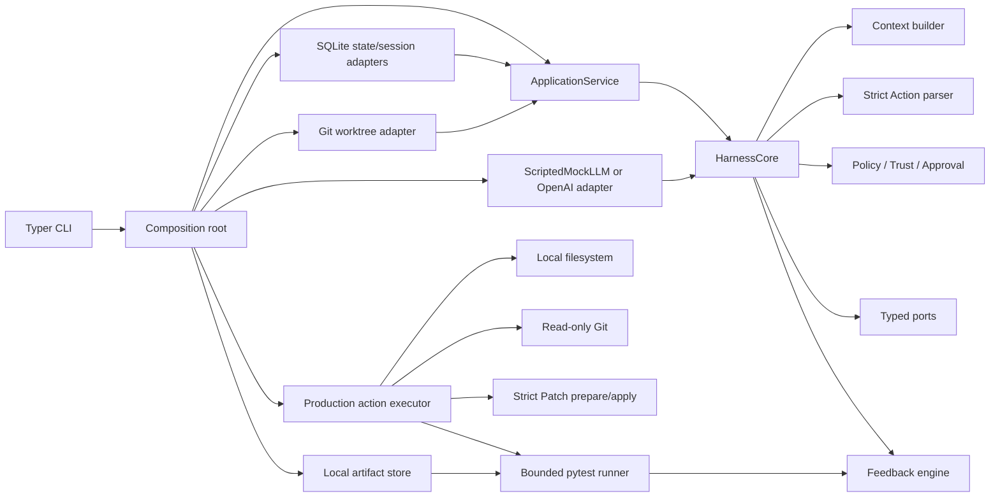
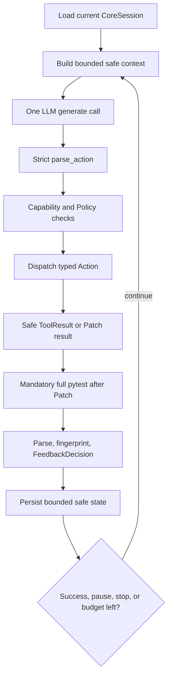
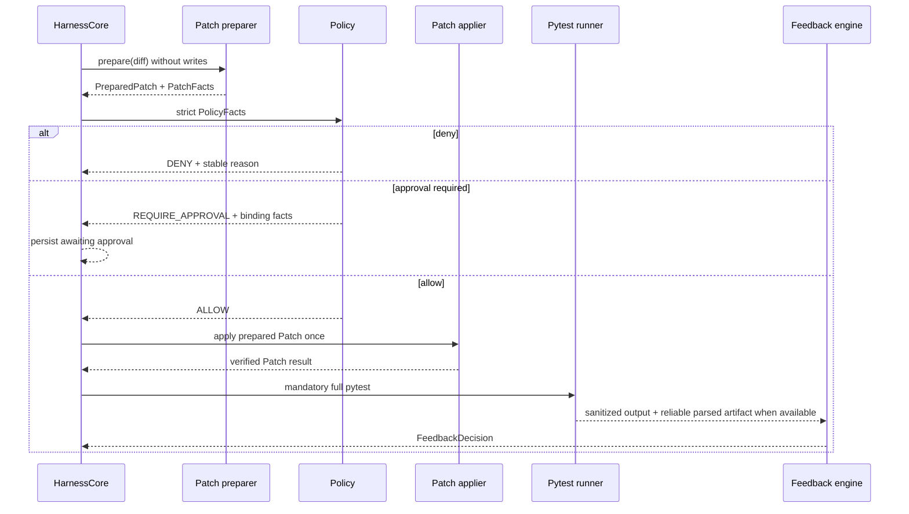

# Architecture

## Component Map



Dependencies point inward. CLI and composition may know concrete adapters. Application and Core accept injected behavior and domain values; they do not import OpenAI, keyring, Typer, SQLite, process launchers, or concrete adapter packages.

## Self-Implemented Agent Loop

`HarnessCore` implements the loop without a packaged Agent runner:



Protocol errors consume budget. A focused test cannot produce task success. Only a reliable full test pass for the governed workspace can succeed. Repeated state fingerprints stop as no progress or loop. Workspace drift and unknown outcomes pause rather than retrying automatically.

## State and Recovery

The application layer creates a strict `CoreSession`, while the persistent session adapter serializes only known UUID, Enum, tuple, history, budget, and status fields into the existing SQLite schema. `status` opens the same data root without constructing a provider. `resume` reloads the session, checks recoverability and worktree identity, and invokes the existing Application Service/Core path. It does not manufacture Trust, Approval, or consumed state.

Task status, Action status, test outcome, Policy outcome, and Approval status remain separate closed vocabularies. Compare-and-set transitions prevent a stale writer from silently replacing newer state.

## Patch and Approval Data Flow



Policy precedence is deny before approval before allow. Test assets, protected configuration, unsafe paths, binary content, shell behavior, missing capabilities, and demo escape are deterministic deny facts. Larger or sensitive-but-supported changes can require an approval bound to the exact Action, diff, paths, preimages, configuration, capabilities, risk, base commit, and status.

## TestRun and Artifact Boundary

The process adapter streams stdout and stderr into independent bounded collectors. Raw bytes live only inside the short-lived execution result passed to redaction/parsing. The runner creates a frozen `SanitizedTestOutput` and stores it through `ArtifactStore`; a reliable parser result gets a separate `ArtifactRef`. References are revalidated for task ownership, schema, media type, length, and SHA-256 when loaded.

`TestRun` records UTC zero-offset timestamps, monotonic duration, frozen command, before/after workspace hashes, outcome, exit code, and safe artifact references. Workspace drift overrides an otherwise parseable pass or failure and removes the parsed result reference.

## Credential boundary

```text
hidden CLI input → KeyringCredentialStore → private adapter read → SDK constructor
```

The public credential port exposes only set/status/update/clear. Plaintext is not returned through that port. Composition asks `OpenAIClientFactory` for a configured provider but never receives the value itself. No environment or `.env` fallback exists.

## Raw-output boundary

```text
pytest process → bounded transient bytes → redaction/parser → verified safe artifacts
                                      └── raw bytes discarded
```

Raw pytest output, provider exception text, credentials, and unrestricted absolute paths do not enter Context, SQLite, artifacts, logs, or CLI rendering.
